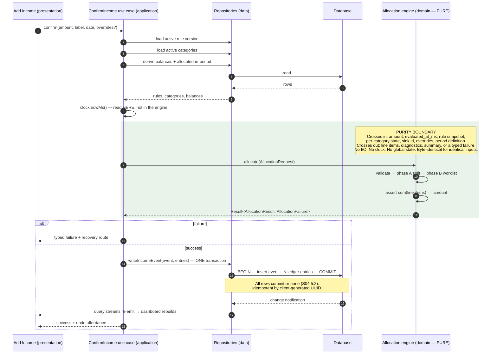
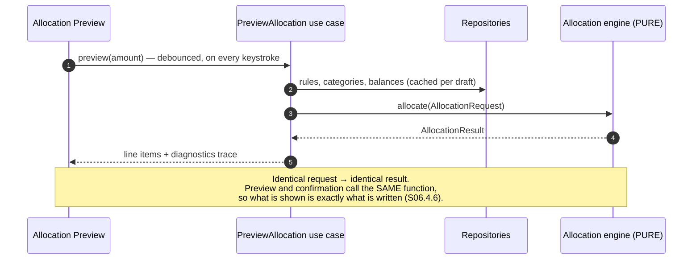

# PookieBudget — architecture

| | |
|---|---|
| **Status** | In progress — Stage 2 |
| **Derived from** | `docs/PRD.md` (approved Stage 1), `00_project_manifest.json` |
| **Sections assembled** | 1, 2, 4, 8, 10 (2.2); 3 (2.1); 5, 6 (2.9) |
| **Sections pending** | 7, 9 (2.12) |

Companion documents: `SCHEMA.md` (data design), `ALLOCATION_ALGORITHM.md` (the engine),
`NAVIGATION.md` (screens and flow), `decisions/ADR-*.md`.

**Vocabulary.** This document and every later design document use the glossary terms of PRD §9.
Product language (PRD §9.1's left column — "goal", "target", "room", "catch-all") is for the user
interface and must not appear here.

---

## 1. Layers

Four layers. The division exists to keep one property true under pressure: **the allocation engine
must be unit-testable with no Flutter, no database and no clock** (INV-08). A boundary that is only
a convention erodes within two stages, so this one is visible in the filesystem (§4) and checked
mechanically (§2.3).

### 1.1 What belongs in each layer

**`domain`** — pure Dart. No Flutter, no I/O, no clock, no global state.

- Value types: `Money`, `Currency`, `BasisPoints`
- Entities: category group, category, account, distribution rule version, rule line, income event,
  allocation, ledger entry, spending transaction, app settings
- Enumerations, all serialised as stable strings
- **The allocation engine** — contracts, split, headroom, worklist, period, override, reversal
- Configuration validators and redirect cycle detection
- Repository **interfaces**, expressed entirely in domain types
- The `Result` type used for expected failures
- The `Clock` and `IdGenerator` **interfaces** (not their implementations)

**`data`** — everything that touches the outside world.

- Database definition, tables, connection, generated code
- Repository implementations and row↔entity mappers
- Balance derivation queries and the recompute-and-compare verifier
- Period boundary computation shared with the engine (§8.4)
- Seed data and the seeder
- Migrations and the backup export/import
- Reporting aggregation queries (Stage 8)
- Sync: remote store abstraction, provider adapter, HLC, merge, repair, outbox, worker, compaction,
  bootstrap
- Authentication
- Real implementations of `Clock` and `IdGenerator`

**`application`** — orchestration.

- Use cases: complete onboarding, preview allocation, confirm income, reverse income, save category,
  save account, log spending, run sync
- Providers exposing repository streams and use-case results
- State notifiers for scope, onboarding progress, the in-flight income draft, sync status

**`presentation`** — Flutter only.

- Screens and widgets
- Theme, design tokens, the business-scope treatment
- The locale-aware money formatter
- Router

### 1.2 The rule that decides placement

If a piece of code could be wrong about *money*, it belongs in `domain`. If it could be wrong about
*storage or the network*, it belongs in `data`. If it could be wrong about *sequencing*, it belongs
in `application`. If it could be wrong about *appearance*, it belongs in `presentation`.

---

## 2. The dependency rule

**Dependencies point inward only.** No layer may import from a layer to its right.

```
domain  ←  data  ←  application  ←  presentation
```

### 2.1 What each layer may import

| Layer | May import | May **not** import |
|---|---|---|
| `domain` | Dart core libraries only (`dart:core`, `dart:math`, `dart:collection`, `dart:convert`) | `package:flutter/*`, `dart:io`, `dart:ui`, the database package, any HTTP or Google package, and `data`, `application` or `presentation` |
| `data` | `domain`; the database package; platform and network packages; `dart:io` | `application`, `presentation`, `package:flutter/material` and other UI packages |
| `application` | `domain`; `data` **repository interfaces and implementations for wiring only**; Riverpod | `presentation`; widget libraries |
| `presentation` | `application`; `domain` types **for display only**; Flutter | `data` — no direct database, repository, sync or network access from a widget |

Two clarifications that would otherwise be argued about later:

- **`presentation` importing `domain`** is permitted so a widget can hold a `Money` or a `Category`
  for rendering. It may not call a domain *validator* or the *engine* — those are reached through
  use cases, so that the preview and the confirmed write cannot diverge.
- **`application` importing `data`** is permitted only to bind an implementation to an interface at
  the composition root. Use-case logic depends on interfaces.

### 2.2 What the domain layer needs injected

Because `domain` performs no I/O and reads no clock, everything it needs arrives from outside:

| Abstraction | Interface in | Real implementation in | Fake in |
|---|---|---|---|
| `Clock` | `domain/money/clock.dart` | `data` | `test/fakes` (S03.8.2) |
| `IdGenerator` | `domain/money/id_generator.dart` | `data` | `test/fakes` (S03.8.3) |
| `CategoryRepository` | `domain/repositories/` | `data/repositories/` | in-memory database (S04.4.7) |
| `AccountRepository` | `domain/repositories/` | `data/repositories/` | in-memory database |
| `RuleRepository` | `domain/repositories/` | `data/repositories/` | in-memory database |
| `LedgerRepository` | `domain/repositories/` | `data/repositories/` | in-memory database |
| `IncomeEventRepository` | `domain/repositories/` | `data/repositories/` | in-memory database |
| `SettingsRepository` | `domain/repositories/` | `data/repositories/` | in-memory database |

**The allocation engine receives none of these.** It is a pure function whose entire world arrives in
its request object — balances, rules, the evaluation timestamp, the period definition. It does not
hold a repository, and does not hold a `Clock`. This is stronger than the rest of the domain layer,
which may hold injected interfaces.

### 2.3 Enforcement — mechanical, not conventional

Stage 3 substage 3.4 implements these. Each must be **demonstrated failing on a deliberate
violation**, with the failure output captured in the Stage 3 report; a guard that has never failed
has never been tested.

| # | Guard | Fails when |
|---|---|---|
| G1 | **Layering** | Any file under `lib/domain/` imports `package:flutter`, `dart:io`, `dart:ui`, the database package, or any path under `lib/data/`, `lib/application/`, `lib/presentation/` |
| G2 | **Engine purity** | Any file under `lib/domain/allocation/` imports anything beyond Dart core, or contains `async`, `await`, `Future`, `Stream`, or `DateTime.now` |
| G3 | **Money type** | `double`, `float` or `num` appears in any file under `lib/domain/` or `lib/data/` outside an allow-list justified in `DEVELOPMENT.md` |
| G4 | **Clock** | `DateTime.now()` appears outside the `Clock` implementation |
| G5 | **Database containment** | Any file outside `lib/data/` imports the database package |
| G6 | **Telemetry** | A known analytics, crash-reporting or advertising package appears anywhere in the *resolved* dependency tree, not merely the direct dependencies |

**What these guards cannot catch, stated so nobody assumes otherwise.** G1–G6 check imports and
tokens. They cannot detect a widget reading an application-layer provider it has no business
reading, because both are in permitted layers. That gap is closed by two non-import mechanisms:
repository providers are declared private to the application layer, and substage 6.1.1 adds an
explicit check that no widget constructs a repository or touches the database. Substage 2.2 does not
treat the import guards as sufficient on their own.

---

## 3. State management

Decided in substage 2.1. Full reasoning, alternatives and consequences: **ADR-001**.

### 3.1 The decision

**Riverpod (3.x line), with code generation for providers.**

The application layer is composed of providers exposing repository streams and use-case results.
Widgets read providers. No widget constructs a repository, opens the database, or calls the
allocation engine directly.

### 3.2 What is held in state, and what is not

| Held in the state layer | Never held — re-derived on demand |
|---|---|
| Active scope (personal / business) | Every category balance |
| Onboarding progress | Every account total |
| The in-flight income draft: amount, label, date, manual overrides | Every report figure |
| Transient UI state: filters, selected period, sort order | Every ceiling progress value |
| Sync status | Anything else derived from ledger entries |

INV-04 makes a balance a derived value. Caching one in a provider would create a second copy that no
recompute-and-compare path verifies. Where a cache is required for performance — and PRD §7.4 shows
it is, at the Heavy profile — it lives in the data layer with the verification path specified in
substage 2.4.5, never in the state layer.

### 3.3 Where use cases live and how they are invoked

Use cases live in the **application** layer. Each orchestrates a sequence — gather balances, call the
engine, write atomically — and returns a typed result the UI maps to a message. A use case contains
no allocation arithmetic; the engine is the only thing that computes a split.

Invocation path, with no step skippable:

```
Widget → (reads) Provider → (invokes) Use case → Repository interface  → Data layer
                                              ↘ Allocation engine (pure, domain)
```

Repository providers are declared private to the application layer. Presentation reaches them only
through use-case providers, so a widget cannot acquire a repository even accidentally.

### 3.4 How a background sync mutation reaches a visible screen

The case the decision turned on. From Stage 7, the sync worker writes to the database while a screen
is visible; INV-06 forbids blocking the UI and FR-13 requires the change to appear without a manual
refresh.

```mermaid
sequenceDiagram
    participant Sync as Sync worker (data)
    participant Repo as Repository (data)
    participant DB as Database
    participant SP as StreamProvider (application)
    participant UI as Dashboard (presentation)

    Note over Sync,UI: The sync layer holds no reference to the UI at all.
    Sync->>Repo: apply merged records
    Repo->>DB: write (transaction)
    DB-->>Repo: change notification on affected tables
    Repo-->>SP: query stream re-emits
    SP-->>UI: providers emit; watching widgets rebuild
```

**The database is the only coupling.** The sync worker does not know the presentation layer exists,
does not publish an event to it, and cannot block it. Any writer — user action, sync merge, restore
from backup, migration repair — propagates identically, because they all write through the same
repository API.

Verification obligations this creates:

| Stage | Obligation |
|---|---|
| S04.4.4 | A test that mutates through a second code path and asserts the stream emits |
| S06.1.3 | The same assertion at screen level: a non-UI mutation updates a visible screen |
| S06.8.5 | Every dashboard figure driven by a reactive query, including for future sync writes |

### 3.5 Enforcement

The layering guard (substage 3.4.4) checks imports, which catches a widget importing the data layer
but **not** a widget reading an application-layer provider it should not. That gap is closed
separately:

| Rule | Enforced by |
|---|---|
| `domain` imports no Flutter, no `dart:io`, no other layer | CI layering guard, S03.4.4 — demonstrated failing on a deliberate violation |
| No widget constructs a repository or touches the database | S06.1.1 check; repository providers private to the application layer |
| No allocation arithmetic outside the engine | S06.4.6 test asserting the preview equals engine output exactly |
| No Riverpod persistence feature is used at any stage | ADR-001 prohibition; the app has its own persistence and sync |

### 3.6 Constraints this places on later stages

1. The engine imports nothing from this layer. If ADR-001 were ever reversed, the domain layer, the
   data layer and their tests are unaffected — the blast radius is application plus presentation.
2. The allocation preview watches **one** provider carrying the whole engine result, not one per
   category, and is debounced (S06.4.2). NFR-06 P-07 budgets 100 ms from keystroke at 40 categories.
3. Flow and journey tests override only the outermost boundaries — clock, id generator, remote store
   — never repositories or use cases, so the graph under test resembles production.

---

## 4. Directory structure

Stage 3 substage 3.2 creates this tree **verbatim**. A folder wanted but absent here is a design
gap: raise it and amend this document rather than inventing it.

### 4.1 Layer-first, not feature-first — and why

Layer-first at the top level. Justified against the two facts that decide it:

- **Screen count (~21) and team size (1).** Feature-first pays off when several developers own
  separate features and want to avoid touching each other's directories. With one developer that
  benefit is zero, while its cost is not.
- **The guards must be mechanical.** `lib/domain/**` being one greppable path is what makes G1, G2
  and G3 simple and reliable. Under feature-first, every guard would need to know which
  subdirectories inside each feature are domain and which are data — a pattern that grows with every
  new feature and silently stops matching when someone names a folder differently. The boundary this
  project most needs to hold is the layer boundary, so the filesystem is organised around it.

Feature grouping still appears **inside** `presentation/screens/` and `application/usecases/`, where
it aids navigation without weakening a guard.

### 4.2 The tree

```
budgeting_app/
├── android/
├── lib/
│   ├── main.dart                      # entry point; composition root only
│   ├── app.dart                       # MaterialApp, theme wiring, router attach
│   │
│   ├── domain/                        # PURE DART — guards G1, G2, G3 apply
│   │   ├── result.dart                # Result<T, F> for expected failures
│   │   ├── money/
│   │   │   ├── money.dart             # int64 minor units; no double anywhere
│   │   │   ├── currency.dart          # ISO 4217 code + minor-unit exponent
│   │   │   ├── basis_points.dart      # 0..10000, validated at construction
│   │   │   ├── clock.dart             # interface only
│   │   │   └── id_generator.dart      # interface only
│   │   ├── entities/
│   │   │   ├── enums.dart             # all enums, stable string serialisation
│   │   │   ├── category_group.dart
│   │   │   ├── category.dart
│   │   │   ├── account.dart
│   │   │   ├── distribution_rule_version.dart
│   │   │   ├── rule_line.dart
│   │   │   ├── income_event.dart
│   │   │   ├── allocation.dart
│   │   │   ├── ledger_entry.dart
│   │   │   ├── spending_transaction.dart
│   │   │   └── app_settings.dart
│   │   ├── allocation/                # THE ENGINE — guard G2 applies, strictest
│   │   │   ├── contracts.dart         # AllocationRequest, AllocationResult
│   │   │   ├── failures.dart          # the sealed error taxonomy
│   │   │   ├── split.dart             # largest-remainder integer split
│   │   │   ├── headroom.dart          # headroom per category type
│   │   │   ├── worklist.dart          # phase B queue, redirects, termination
│   │   │   ├── period.dart            # period boundary arithmetic (pure)
│   │   │   ├── override.dart          # manual override redistribution
│   │   │   ├── reversal.dart          # compensating entry generation
│   │   │   └── engine.dart            # the public entry point
│   │   ├── validation/
│   │   │   ├── validators.dart
│   │   │   ├── cycle_detection.dart
│   │   │   └── validation_failure.dart
│   │   └── repositories/              # INTERFACES ONLY
│   │       ├── category_repository.dart
│   │       ├── account_repository.dart
│   │       ├── rule_repository.dart
│   │       ├── ledger_repository.dart
│   │       ├── income_event_repository.dart
│   │       └── settings_repository.dart
│   │
│   ├── data/                          # guard G5: only this layer imports the DB package
│   │   ├── database/
│   │   │   ├── database.dart
│   │   │   ├── connection.dart        # opens the DB; enables foreign keys explicitly
│   │   │   ├── converters/
│   │   │   └── tables/                # one file per table
│   │   ├── repositories/              # implementations of the domain interfaces
│   │   ├── mappers/                   # row ↔ entity, one place, round-trip tested
│   │   ├── balances/
│   │   │   ├── balance_queries.dart
│   │   │   ├── balance_verifier.dart  # recompute-and-compare (INV-04)
│   │   │   └── period_boundaries.dart # single home; see §8.4
│   │   ├── seed/
│   │   │   ├── seed_data.dart         # the 19 suggestions, externalised strings
│   │   │   └── seeder.dart            # idempotent, non-destructive
│   │   ├── migrations/
│   │   │   ├── migrations.dart
│   │   │   └── v1.dart
│   │   ├── backup/
│   │   │   ├── export_json.dart
│   │   │   └── import_json.dart
│   │   ├── reporting/                 # Stage 8
│   │   │   └── queries.dart
│   │   ├── sync/                      # Stage 7
│   │   │   ├── remote_store.dart      # provider-agnostic interface
│   │   │   ├── hlc.dart
│   │   │   ├── merge.dart
│   │   │   ├── repair.dart
│   │   │   ├── outbox.dart
│   │   │   ├── worker.dart
│   │   │   ├── compaction.dart
│   │   │   ├── bootstrap.dart
│   │   │   └── adapters/
│   │   │       └── drive/             # the ONLY place the provider SDK appears
│   │   ├── auth/                      # Stage 7
│   │   ├── clock_impl.dart
│   │   └── id_generator_impl.dart
│   │
│   ├── application/
│   │   ├── providers/                 # repository + engine wiring; composition root
│   │   ├── usecases/
│   │   │   ├── onboarding/
│   │   │   ├── income/                # preview, confirm, reverse
│   │   │   ├── spending/
│   │   │   ├── categories/
│   │   │   ├── accounts/
│   │   │   └── sync/
│   │   └── state/                     # scope, onboarding progress, income draft, sync status
│   │
│   └── presentation/
│       ├── router/
│       │   ├── router.dart
│       │   └── routes.dart
│       ├── theme/
│       │   ├── tokens.dart            # spacing, typography, colour — the only literals
│       │   ├── app_theme.dart         # light + dark
│       │   └── business_scope_theme.dart
│       ├── formatting/
│       │   └── money_formatter.dart   # locale grouping + symbol; see §8.5
│       ├── widgets/                   # shared primitives: money text, progress, empty/error/loading
│       └── screens/
│           ├── onboarding/
│           ├── dashboard/
│           ├── income/
│           ├── categories/
│           ├── accounts/
│           ├── spending/
│           ├── history/
│           ├── reports/
│           ├── settings/
│           └── sync/
│
├── test/                              # mirrors lib/ exactly
│   ├── domain/
│   │   ├── money/
│   │   ├── entities/
│   │   ├── allocation/
│   │   └── validation/
│   ├── data/
│   │   ├── repositories/
│   │   ├── balances/
│   │   ├── seed/
│   │   ├── migrations/
│   │   ├── backup/
│   │   ├── reporting/
│   │   └── sync/
│   ├── application/
│   ├── presentation/
│   ├── fixtures/
│   │   ├── allocation/                # the golden vector JSON files
│   │   └── databases/                 # migration fixture DBs, one per schema version
│   └── support/
│       ├── fakes/                     # fake Clock, deterministic IdGenerator, fake RemoteStore
│       ├── builders/                  # entity test-data builders
│       └── vector_loader.dart         # reads fixtures/allocation/ with no code change per vector
│
├── integration_test/
├── tool/
│   ├── reconcile.dart                 # Stage 9 independent money audit
│   └── guards/                        # G1..G6 check scripts
├── docs/
└── .github/workflows/
```

**A test's location is always predictable from the file it covers:** `lib/domain/allocation/split.dart`
is tested by `test/domain/allocation/split_test.dart`.

### 4.3 Notable placements, and why

| Placement | Reason |
|---|---|
| `domain/allocation/period.dart` **and** `data/balances/period_boundaries.dart` | Two files, one authority — see §8.4. The domain file owns the arithmetic; the data file only applies it to a query. |
| `data/sync/adapters/drive/` isolated | The only directory where the provider SDK may appear (S07.2.5 adds a check). Keeps the provider replaceable and the privacy surface auditable. |
| `presentation/formatting/money_formatter.dart` | Display formatting is presentation. Machine-readable serialisation is **not** here — see §8.5. |
| `test/fixtures/databases/` | Migration fixtures, one per schema version, committed from v1.0 (NFR-07). |
| `tool/guards/` | The guards are scripts in the repository, runnable locally, not CI-only configuration. |

---

## 5. Sync architecture

Decided in substage 2.9. The storage target and its justification are **ADR-002**; this section is
the design that follows from it.

**The controlling constraint:** the client does all merging, because NG-08 means there is nowhere
else for it to happen (IMP-15). Every design choice below follows from that plus INV-06 — the user
never waits on the network.

### 5.1 Remote file layout

```
appDataFolder/
├── manifest.json                       # small, read first, written last
├── snapshots/
│   └── <snapshot-id>.json.gz           # full state at a point in time
└── chunks/
    └── <device-id>/
        └── <hlc>.json.gz               # append-only change chunks, one writer each
```

**Per-device chunk directories are the single most important structural decision here.** Two devices
never write the same file, so the majority of write conflicts are removed *by construction* rather
than resolved after the fact. Writing all devices to one shared file would manufacture conflicts the
merge engine would then have to untangle — named as a pitfall by substage 7.3.

### 5.2 `manifest.json`

Read before anything else on every sync; written last on every mutation of the store.

| Field | Purpose |
|---|---|
| `schema_version` | The `kSchemaVersion` constant (SCHEMA §7.4). **Newer than the app understands → refuse, never partially parse** |
| `encryption` | `{"scheme": "none"}` in v1.0. **The D-04 accommodation** — present from day one so a later encrypted version can be adopted without a client being unable to tell an unencrypted payload from a corrupt one |
| `compression` | `"gzip"`. Recorded rather than assumed, so it can change without breaking older readers |
| `latest_snapshot_id` | Which snapshot bootstraps a new device |
| `snapshot_hlc` | The HLC the snapshot is current as of; chunks at or below this are superseded |
| `devices[]` | The device registry: `device_id`, `last_seen_ms`, `last_acknowledged_snapshot_id`, `last_acknowledged_hlc` |
| `currency_code`, `currency_minor_exponent` | Checked before any merge — a mismatch is refused, never converted (§5.7) |
| `compaction_state` | `IDLE` \| `IN_PROGRESS`, with the in-progress snapshot id, so an interrupted compaction is recoverable |

**The device registry is what makes safe tombstone purging possible** (SCHEMA §7.3): a tombstone may
only be purged once every registered device has acknowledged a snapshot beyond it.

### 5.3 What a chunk contains

A chunk is an ordered list of record changes written by one device since its last chunk: table name,
record id, operation (`UPSERT` / `TOMBSTONE`), the record's full field set for an upsert, and its
HLC. Chunks are **append-only and immutable** once written — a device writes a new chunk rather than
amending an old one, which is what makes them safe to read concurrently.

### 5.4 The sync cycle

```mermaid
sequenceDiagram
    autonumber
    participant W as Sync worker
    participant R as RemoteStore
    participant M as Merge engine
    participant V as Validators + repair
    participant DB as Local database

    W->>R: read manifest.json
    R-->>W: manifest
    Note over W: refuse if schema_version newer, or currency mismatches
    W->>R: list chunks newer than our last applied HLC
    W->>R: fetch those chunks
    R-->>M: remote changes
    M->>M: merge per record class (§6.1)
    M->>V: validate merged state BEFORE commit
    V->>V: repair deterministically if invalid; record every repair
    V->>DB: commit merged + repaired state (one transaction)
    V->>DB: mark balance cache stale, then full recompute-and-compare
    W->>DB: drain outbox
    W->>R: write our chunk
    W->>R: update manifest (device registry, our acknowledgement)
```

**Validation runs before the commit, never after.** Committing first would persist an invalid state
briefly and let it sync outward to other devices — substage 7.6's pitfall names exactly this.

**A merge is never trusted with balances.** The full recompute-and-compare (SCHEMA §7.1) runs after
every merge, without exception.

### 5.5 The sync state machine

| State | Meaning | User-visible treatment |
|---|---|---|
| `LOCAL_ONLY` | No account linked | A quiet, permanent "on this device only" indicator with a backup action attached. Not an error, not a warning colour, never repeated (PRD A-11) |
| `IDLE` | Signed in, nothing pending | Last synced time |
| `PENDING` | Local changes queued | Last synced time plus a pending count |
| `SYNCING` | A cycle is running | A subtle indicator. **Never a modal, never a blocking spinner** |
| `ERROR_RETRYING` | Transient failure; backoff in progress | Last synced time; no alarm. The app is unaffected |
| `ERROR_NEEDS_USER` | Sign-in expired, access revoked, quota exceeded, remote schema newer, currency mismatch | The **only** state that surfaces an action, and it still blocks nothing |

**No state blocks the UI. Ever.** INV-06 is not a preference, and substage 7.9's acceptance criteria
require a test per state.

### 5.6 Compaction and bootstrap

**Compaction** replaces accumulated chunks with a fresh snapshot, in a strict order chosen so that
interruption at any point leaves the store readable:

1. Write the new snapshot to `snapshots/`.
2. Update `manifest.json` to point at it.
3. **Only then** delete superseded chunks.

Interrupted after step 1: an orphan snapshot exists, nothing references it, readers are unaffected.
Interrupted after step 2: the manifest points at a valid snapshot; superseded chunks still exist and
are merely redundant. **Reversing steps 2 and 3 would lose data** on interruption — the manifest
would reference a snapshot while its source chunks were already gone.

**Bootstrap** for a device that has just signed in:

1. Fetch the latest snapshot.
2. Apply every chunk newer than `snapshot_hlc`.
3. **Merge with existing local data** — never replace it.

Step 3 is the case that matters: **the common path is a user who tried the app first and signed in
afterwards**, so the local database is usually non-empty. Bootstrap that assumes an empty local
database duplicates everything the user entered before signing in (substage 7.8's pitfall). Because
merging is union-by-UUID for immutable records, a genuine re-bootstrap of the same device is
idempotent.

### 5.7 Adverse remote conditions

| Condition | Behaviour |
|---|---|
| **Remote store missing entirely** — the user wiped the app's Drive data | Treat as a **fresh** remote. Push a first snapshot. **Never delete local data.** An absent remote is not evidence of deletion; only an explicit tombstone is (INV-10). US-031 |
| **Remote `schema_version` newer than the app** | Refuse the whole sync, enter `ERROR_NEEDS_USER`, prompt to update. **Never partially parse an unknown format** |
| **Currency configuration mismatch** | Refuse, explain plainly, **never convert**. Almost certainly a wrong-account sign-in |
| **Corrupted or truncated chunk** | Skip that chunk, record it, continue with the others. One bad chunk must not block every other device's changes. Surfaced in the repair log |
| **Quota exceeded** | `ERROR_NEEDS_USER` with a specific message. Realistic, because the data is on the user's own quota |
| **Version conflict on write** (ETag mismatch) | Re-read, re-merge, retry with bounded exponential backoff and jitter. **Never blind-overwrite** |

---

## 6. Merge semantics and the hybrid logical clock

### 6.1 Merge rules, per record class

**Not one blanket policy.** A single last-write-wins rule across the whole database would discard a
device's entire offline week of transactions — R-03, and the anti-pattern the Stage 2 plan names.

| Record class | Tables | Rule |
|---|---|---|
| **Immutable** | `ledger_entries`, `income_events`, `spending_transactions` | **Union by UUID.** These are never edited, so they **cannot conflict**. A duplicate id is ignored, never overwritten |
| **Mutable configuration** | `categories`, `accounts`, `category_groups`, `distribution_rule_versions`, `rule_lines`, `app_settings` | **Last-write-wins, ordered by HLC**, with `device_id` as the final deterministic tie-break |
| **Tombstones** | any synced table except `ledger_entries` | A tombstone **beats an older edit**. A peer that was offline when the delete happened cannot resurrect the record |
| **Device-local** | `sync_metadata`, `outbox`, `balance_cache` | **Never synced.** Balances are always recomputed locally, so a merge can never import one |

**This is why the ledger is append-only.** INV-03 is usually justified as an audit requirement, but
it is also what makes sync safe: because ledger entries are immutable, they merge by union and no
money can ever be lost to a conflict resolution. The sync design depends on the invariant.

### 6.2 Last-write-wins is per record, not per field — and why that is acceptable

**Decision: per record.** Substage 2.9.4 requires this to be stated explicitly rather than left
ambiguous.

The cost is real: if device A renames a category while device B changes its ceiling, and both sync
afterwards, **one of those edits is lost** — the losing record is replaced wholesale.

Per-field resolution would avoid that, at the cost of an HLC per field. A category has roughly
twenty fields, so per-field tracking multiplies the sync metadata on the most-edited table by twenty,
permanently, in every chunk and every snapshot.

**Per record is chosen because of what LWW can and cannot touch:**

> **Last-write-wins never applies to money.** Every table it governs is configuration. Money lives in
> `ledger_entries`, `income_events` and `spending_transactions`, which merge by union and are
> immutable. The worst outcome of a per-record conflict is a lost category rename — annoying,
> recoverable in seconds, and visible. It is never a lost transaction.

Combined with the fact that this is a **single-user** app (NG-02), where simultaneous edits to the
same category from two devices require the user to be in two places at once, the exposure is small
and the saving is permanent.

**Mitigation:** every LWW resolution that discarded a competing edit is recorded in the repair log
and surfaced to the user (substage 7.6.4), so a lost rename is visible rather than mysterious.

### 6.3 How a delete on device A survives device B being offline for a month

The scenario substage 2.9's acceptance criteria call out explicitly.

1. **Day 1** — Device A soft-deletes a category: `is_deleted = 1`, `deleted_at_ms` set, and a new HLC
   assigned. The row **stays**; only its tombstone flag changes. A's chunk carries the tombstoned
   record.
2. **Days 1–30** — Device B is offline. It still holds the record with its older HLC, untombstoned,
   and knows nothing of the delete.
3. **Day 30** — B reconnects and syncs. It fetches A's chunk and finds the tombstoned record with a
   **strictly greater HLC** than its own copy. The tombstone wins on ordering alone; no special case
   is required.
4. B applies the tombstone locally. If B had also edited that category offline, its edit carries a
   **lower** HLC and loses — the tombstone rule states that a delete beats an older edit.
5. B's own chunk still carries its (now superseded) version. A will fetch it, compare HLCs, and keep
   the tombstone. **Convergence, and the record is not resurrected.**

**What makes this work is that the tombstone is never purged too early.** SCHEMA §7.3's safe-purge
condition requires that every registered device has acknowledged a snapshot beyond the tombstone,
*and* that 180 days have passed. Had the tombstone been purged on a timer at, say, 7 days, B would
have arrived at day 30 seeing no tombstone at all, treated its own copy as current, and pushed the
record back to life. Purging on a timer alone is the defect; the registry is the fix.

### 6.4 The hybrid logical clock

Raw wall-clock comparison is unsafe: a device with a wrong clock — common, and users change clocks
deliberately — would have its edits ordered wrongly, permanently and invisibly (R-08).

**Format:** `physical_ms` (48-bit), `logical_counter` (16-bit), `device_id`.

**Serialisation** is a fixed-width, lexicographically sortable string, so that string ordering and
numeric ordering agree everywhere: zero-padded hex physical, zero-padded hex counter, device id.
A serialisation that is not lexicographically sortable makes ordering differ between comparison
paths — substage 7.4's pitfall.

**Advance rule on local write:**

```
pt := wall_clock_now_ms
IF pt > local.physical:
    local.physical := pt
    local.counter  := 0
ELSE:
    local.counter  := local.counter + 1     // physical unchanged; counter breaks the tie
```

The clock **never moves backwards**, even if the wall clock does — the `>` comparison guarantees it.

**Advance rule on receiving a remote HLC:**

```
pt    := wall_clock_now_ms
l_new := max(local.physical, remote.physical, pt)

IF l_new == local.physical AND l_new == remote.physical:
    counter := max(local.counter, remote.counter) + 1
ELSE IF l_new == local.physical:
    counter := local.counter + 1
ELSE IF l_new == remote.physical:
    counter := remote.counter + 1
ELSE:
    counter := 0                            // wall clock advanced past both

local := (l_new, counter)
```

**Comparison** is lexicographic on `(physical, counter, device_id)`. Including `device_id` makes the
ordering **total**: no two distinct HLCs ever compare equal, so every conflict has a deterministic
winner and two devices performing the same merge reach the same result.

**Persistence.** HLC state lives in `sync_metadata` and is written on every advance. An HLC that
resets on app restart silently reorders history — substage 7.4's pitfall, and the reason the state is
persisted rather than held in memory.

**Device id** is generated once at install and persisted. It is **never derived from a hardware
identifier** (substage 7.4.4): hardware ids are a privacy problem, they are restricted on modern
Android anyway, and a random UUID serves the purpose completely.

---

## 8. Cross-cutting concerns

### 8.1 Error handling

The domain layer returns **typed results** for expected failures and reserves exceptions for
programmer error.

- `Result<T, F>` is a sealed type in `domain/result.dart`. A validator returns
  `Result<void, ValidationFailure>`; the engine returns `Result<AllocationResult, AllocationFailure>`.
- **Nothing in the domain layer throws for an expected condition.** An invalid configuration, an
  over-maximum income, a bad override — all are values, not exceptions.
- Exceptions are permitted only for states that indicate a bug: a conservation assertion failing
  inside the engine, a mapper receiving a row with an impossible enum value.
- Every user-visible failure carries enough context for a specific message — the offending category
  or group, and the offending value — plus a recovery action. "Something went wrong" is not an
  acceptable terminal state (§6.1 of the PRD's NFR treatment).

### 8.2 Logging

**No financial data is logged at any level, in any build.** Specifically forbidden in log output:
monetary amounts, category names, account names or labels, note text, and the contents of any entity
that carries them.

Permitted: record identifiers, enum values, counts, durations, error types, and sync state
transitions. "Merged 47 records, 3 repairs" is acceptable; "Groceries balance 12,500" is not.

The allocation engine logs **nothing** — it is pure. Diagnostics reach the caller through the result
object, which the UI renders; they are never written to a log.

Enforcement: substage 7.10.4 runs a full session at verbose logging and scans the output for
amounts, category names and account labels, then adds an automated check so it cannot regress.

### 8.3 Time

- **Storage is always int64 UTC epoch milliseconds** (INV-09), for every timestamp in every table
  and every payload.
- `DateTime.now()` is banned outside the `Clock` implementation, enforced by guard G4.
- The engine never reads a clock at all: the evaluation timestamp arrives in the request (INV-08).
- **Local timezone is applied in exactly two places:** the presentation layer, when displaying a
  date; and the reporting query layer, when computing calendar-month and calendar-year boundaries
  (PRD A-18). The reporting layer receives the timezone as an **input** rather than reading it
  from the platform, so period boundary behaviour is testable without changing the device timezone.

### 8.4 Period boundaries — one authority, two callers

Fixed-recurring categories need to know which period an evaluation falls in. Two layers need this:
the engine (to compute headroom) and the data layer (to compute how much was already allocated this
period). Implemented twice, the anchor-day-31-in-February rule will drift — the two would disagree
about which period a payment belongs to, and headroom would be computed against the wrong window.

**Therefore:** `domain/allocation/period.dart` is the single authority. It is pure arithmetic —
given an anchor day, an instant and a timezone offset, it returns the period boundaries.
`data/balances/period_boundaries.dart` contains **no** period arithmetic; it calls the domain
function and applies the result to a query.

The rule for the anchor day that does not exist in a short month is fixed in substage 2.10.4 and
implemented once, here.

### 8.5 Money: two representations, two homes

| Purpose | Where | Produces |
|---|---|---|
| **Serialisation** — CSV export, JSON backup | `domain/money/money.dart` — a pure `toDecimalString()` | An exact decimal string derived by integer arithmetic from minor units, respecting the currency exponent. No locale, no grouping separator, no symbol. |
| **Display** | `presentation/formatting/money_formatter.dart` | A locale-aware string with grouping separators and the currency symbol. |

The display formatter is built on the serialisation function; it never re-derives the decimal
placement. **Neither path may involve a floating-point value at any point**, including intermediates
— guard G3, plus substage 3.6's acceptance criterion that the formatter has no code path accepting
or returning a floating-point number.

This split is why the CSV exporter in `data/` does not import the presentation layer: it needs
serialisation, not display.

### 8.6 Identifiers

All primary keys are client-generated UUIDs stored as text (INV-12), so records created offline on
separate devices never collide and every write is idempotent.

| Record class | Version | Reason |
|---|---|---|
| Ledger entries, income events, allocations | **UUID v7** | Time-sortable. PRD §7.2 shows these are 80–89% of all rows at the Heavy profile, so insert locality in the index matters. |
| Configuration — categories, accounts, rule versions, settings | **UUID v4** | Low volume, no ordering benefit, and v4 avoids embedding record-creation times in the sync payload. |

Identifier generation goes through the injected `IdGenerator`, so tests get deterministic ids and
expected outputs stay stable across runs.

---

## 10. Sequence diagrams

### 10.1 Confirming an income event — the money path

The path that must never lose a unit. The engine purity boundary is marked explicitly: everything
inside it is a pure function of its inputs.



**What the diagram fixes:**

1. Balances are gathered **before** the engine runs and passed in. The engine never fetches.
2. The clock is read in the use case; the resulting timestamp crosses the boundary as data.
3. The engine returns either a complete conserved result or a failure — never a partial allocation.
4. The write is one transaction covering the event and every ledger entry.
5. The UI learns of the change through the database's own notification, the same path a background
   sync write uses (§3.4).

### 10.2 Previewing an allocation — the same engine, no write



The preview and the confirmed write differ in exactly one respect: the preview does not persist.
They share the request construction and the engine call, which is what makes the substage 6.4.6
assertion — preview output equals engine output equals what confirmation writes — provable rather
than hopeful.
