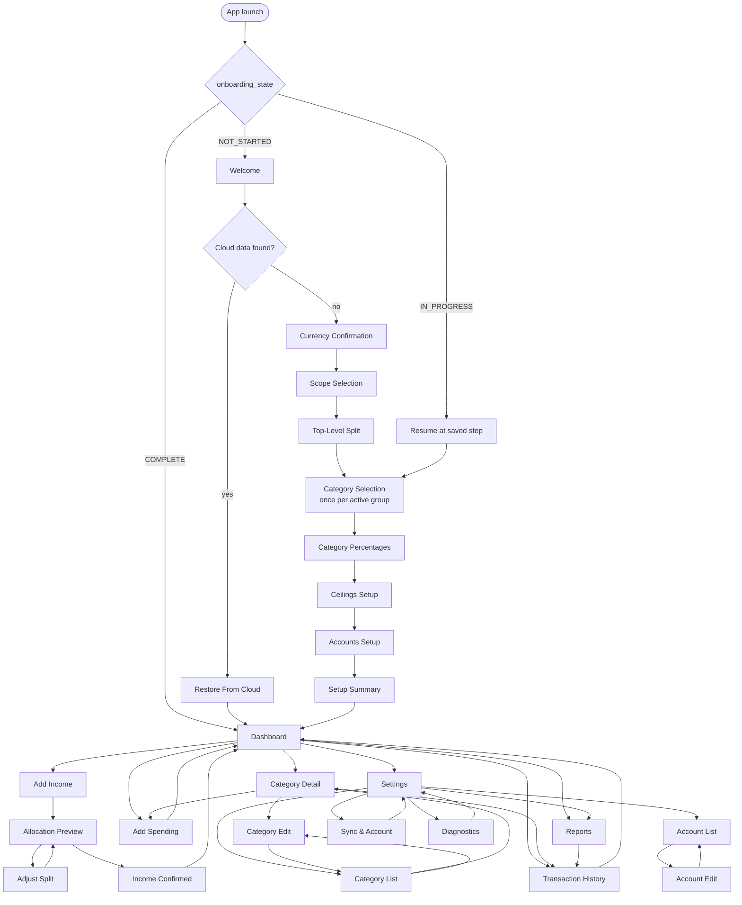

# PookieBudget — navigation, screens and states

| | |
|---|---|
| **Status** | Complete — substage 2.11 |
| **Derived from** | `docs/PRD.md` §2 (journeys), §3.3 (cut line), §5 (stories) |
| **Consumed by** | Stage 3 substage 3.7 (stubs, one per route), Stage 6 (every screen) |

**This is structure, states and flow — not visual design.** No layout, colour, spacing or component
choice appears here. Stage 3 builds one placeholder per route; Stage 6 fills them.

**Two rules govern this inventory** (substage 2.11.1):

1. Every PRD journey step maps to a named screen — no journey step is homeless.
2. No screen exists without a journey that reaches it — screens invented in design that no journey
   reaches are a Stage 6 cost with no user behind them.

---

## 1. Screen inventory

Twenty-two screens. The PRD §2.3 label set is carried through unchanged, with one addition
(`Diagnostics`) justified in §1.3.

### 1.1 Onboarding

| Screen | Route | Purpose | Entry | Exit | Journey step |
|---|---|---|---|---|---|
| `Welcome` | `/onboarding/welcome` | One sentence on what the app does | Cold start when `onboarding_state = NOT_STARTED` | → Currency | J1-A 1, J2-A 1 |
| `Currency Confirmation` | `/onboarding/currency` | Confirm the currency detected from device locale | ← Welcome | → Scope | J1-A 2, J2-A 2 |
| `Scope Selection` | `/onboarding/scope` | Personal only, or personal plus business | ← Currency | → Top-Level Split | J1-A 3, J2-A 3 |
| `Top-Level Split` | `/onboarding/groups` | Group percentages, pre-filled and valid | ← Scope | → Category Selection | J1-A 4, J2-A 4 |
| `Category Selection` | `/onboarding/categories/:group` | Suggested categories, pre-ticked and editable. **Visited once per active group** | ← Top-Level Split | → next group, then Percentages | J1-A 5–6, J2-A 5–6 |
| `Category Percentages` | `/onboarding/percentages` | Within-group shares, pre-filled and valid | ← Category Selection | → Ceilings | J1-A 7, J2-A 7 |
| `Ceilings Setup` | `/onboarding/ceilings` | Optional targets and redirect targets. **Skippable** | ← Percentages | → Accounts | J1-A 8, J2-A 8 |
| `Accounts Setup` | `/onboarding/accounts` | Optional account labels. **Skippable** | ← Ceilings | → Summary | J1-A 9, J2-A 9 |
| `Setup Summary` | `/onboarding/summary` | The whole configuration in one view | ← Accounts | → Dashboard (writes config) | J1-A 10, J2-A 10 |

### 1.2 Core

| Screen | Route | Purpose | Entry | Exit | Journey step |
|---|---|---|---|---|---|
| `Dashboard` | `/` | Balances, ceiling progress, recent activity | Cold start when onboarding complete; from anywhere via the shell | → Add Income, Add Spending, Category Detail, History, Reports, Settings | J1-A 11, J1-B 12, J1-C 18/20/21, J2 |
| `Add Income` | `/income/add` | Amount, source label, date, note | ← Dashboard | → Allocation Preview | J1-B 13, J2-B 13 |
| `Allocation Preview` | `/income/preview` | Per-category amounts, the diagnostics trace, the running total | ← Add Income | → Income Confirmed, or → Adjust Split | J1-B 14–15, J2-B 14–16 |
| `Adjust Split` | `/income/adjust` | Per-category manual override | ← Allocation Preview | → Allocation Preview (recomputed) | US-016 |
| `Income Confirmed` | `/income/confirmed` | What happened, including redirects, with undo | ← Allocation Preview | → Dashboard | J1-B 16, J2-B 17 |
| `Add Spending` | `/spending/add` | Amount, category, account, date, note | ← Dashboard, ← Category Detail | → Dashboard | J1-C 19 |
| `Category Detail` | `/categories/:id` | Balance, ceiling progress, redirect destination, recent entries | ← Dashboard, ← Category List | → Category Edit, → Add Spending | J1-C 22 |
| `Transaction History` | `/history` | Filterable list with running balances | ← Dashboard, ← Category Detail | → entry detail, → reversal | US-026 |

### 1.3 Management

| Screen | Route | Purpose | Entry | Exit | Journey step |
|---|---|---|---|---|---|
| `Category List` | `/categories` | All categories grouped, business visually distinct | ← Settings, ← Dashboard | → Category Detail, → Category Edit | US-006 |
| `Category Edit` | `/categories/:id/edit`, `/categories/new` | Name, group, type, percentage, ceiling, bill, anchor, redirect target, account | ← Category List, ← Category Detail | → back, on valid save | US-004…US-007, US-018, US-020 |
| `Account List` | `/accounts` | Accounts with derived totals | ← Settings | → Account Edit | US-011 |
| `Account Edit` | `/accounts/:id/edit`, `/accounts/new` | Name, institution, last four, scope | ← Account List | → back, on valid save | US-011, US-012 |
| `Reports` | `/reports` | Monthly and yearly summaries, trends, export | ← Dashboard, ← Settings | → drill-down into History | US-033…US-037 |
| `Settings` | `/settings` | Scope, currency, categories, accounts, sync, backup, about | ← Dashboard | → most other screens | US-002, US-032 |
| `Sync & Account` | `/settings/sync` | Sign-in state, last sync, pending count, repair log, controls | ← Settings | → back | US-028…US-031, FJ-2 |
| `Restore From Cloud` | `/onboarding/restore` | Offered when a new install finds existing cloud data | ← Welcome (after sign-in detects data) | → Dashboard | FJ-4 2–5, FJ-5(a) |
| **`Diagnostics`** | `/settings/diagnostics` | Recompute-and-compare, repair log, export | ← Settings | → back | *See §1.4* |

### 1.4 The one screen with no PRD journey

`Diagnostics` is not reached by any journey in PRD §2. It exists because the design requires a
user-facing entry point for the recompute-and-compare verifier (SCHEMA §7.1, "on user request from
the diagnostics screen") and the repair log (§6.8, "surfaced to the user"). Without a screen, those
are features with nowhere to live.

**Recorded as a deviation** rather than quietly added, per rule 2 above. It is reached only from
Settings, is never on a primary path, and is the natural home for the Stage 9 reconciliation
surface. If Stage 6 finds it unnecessary, it can be dropped without affecting any journey.

### 1.5 Journey coverage check

| Journey | Steps | All mapped |
|---|---|---|
| J1-A first launch → dashboard | 11 | ✅ Welcome, Currency, Scope, Top-Level Split, Category Selection ×2, Percentages, Ceilings, Accounts, Summary, Dashboard |
| J1-B first salary | 6 (12–17) | ✅ Dashboard, Add Income, Allocation Preview ×2, Income Confirmed, Dashboard |
| J1-C spend and return | 5 (18–22) | ✅ Dashboard, Add Spending, Dashboard ×2, Category Detail |
| J2-A business setup | 11 | ✅ Same as J1-A plus Category Selection for the business group |
| J2-B business overflow | 7 (12–18) | ✅ Dashboard, Add Income, Allocation Preview ×3, Income Confirmed, Dashboard |
| FJ-1 no internet | 6 | ✅ Onboarding chain + income chain; no screen requires network |
| FJ-2 permission revoked | 7 | ✅ Dashboard, Sync & Account |
| FJ-3 mistaken income undone | 7 | ✅ Dashboard, Transaction History, Add Income |
| FJ-4 second device | 6 | ✅ Welcome, Sync & Account, Restore From Cloud, Dashboard |
| FJ-5 phone replaced | — | ✅ As FJ-4 (branch a); branch b has no in-app path by design (ESC-1.2-A) |
| FJ-6 cloud copy vanishes | 6 | ✅ Dashboard, Sync & Account |
| FJ-7 rules changed | 5 | ✅ Dashboard, Transaction History, Category Edit |

**All 40 primary-journey steps and all 7 failure journeys map to named screens.** One screen
(`Diagnostics`) has no journey — declared in §1.4.

---

## 2. The navigation graph

### 2.1 Graph checks

| Check | Result |
|---|---|
| **Unreachable screens** | None. Every screen has at least one inbound edge from a reachable node |
| **Dead ends** | None. Every screen has an outbound edge or a back path (§4) |
| **Cycles that trap the user** | None. `Adjust Split ↔ Allocation Preview` is a deliberate loop the user exits by confirming or backing out |
| **Screens with no journey** | One: `Diagnostics` (§1.4) |

---

## 3. Navigation approach

**A declarative router with typed routes.**

Justified against this app's specific needs rather than in general:

- **Startup routing is state-driven**, not action-driven: `onboarding_state` decides between three
  destinations at cold start (§2). A declarative router expresses that as a redirect rule; an
  imperative one would need push/pop logic in a widget's lifecycle.
- **Onboarding must resume where it left off** after the process is killed (US-002, substage 6.2.4).
  Route-per-step plus persisted progress makes this a redirect; a single stateful widget holding an
  index makes it a serialisation problem.
- Deep links are out of scope for v1 (§6), so no argument for a router turns on them — the decision
  rests entirely on the two points above.

---

## 4. Android back behaviour

Specified per flow, because leaving it to the framework default is how a multi-step onboarding loses
a user's input (substage 2.11's `common_pitfalls`).

| Flow | Back behaviour |
|---|---|
| **Onboarding, steps 2–10** | Returns to the previous step **with all entered data intact**. Progress is persisted on every step transition, so the data survives process death as well as back navigation |
| **Onboarding, `Welcome`** | Exits the app. Nothing has been committed |
| **`Restore From Cloud`** | Returns to `Welcome`; the user may decline the restore and set up fresh. Declining does **not** delete the cloud data |
| **`Allocation Preview` → `Add Income`** | **Preserves the entered amount, label, date and note.** Losing a typed amount because the user wanted to check something is a trust failure, not an inconvenience |
| **`Adjust Split` → `Allocation Preview`** | Discards uncommitted override edits **after a confirmation**, since they represent deliberate input |
| **`Income Confirmed`** | Returns to `Dashboard`. Back does **not** return to the preview — the event is written, and re-entering the preview would imply it is still editable. Undo is available from the confirmation screen and from history |
| **Edit screens** (`Category Edit`, `Account Edit`) | With unsaved changes: confirm before discarding. Without: back immediately |
| **`Dashboard`** | Exits the app. **No confirmation** — nothing is in flight, and a confirm-to-exit prompt on the home screen is a well-known irritation |
| **Any screen during a sync** | Unaffected. Sync never blocks navigation (INV-06) |

---

## 5. Business scope separation

**Decision: a scope filter applied centrally, not a separate tab or a global mode switch.**

Justified against NFR-03 and against the alternatives:

- **A separate business tab** would duplicate every screen — dashboard, categories, history, reports
   — and duplicated screens drift apart. It also implies business is a *place* rather than a
  property of the money, which makes a combined view awkward to express honestly.
- **A global mode switch** ("you are now in business mode") risks the worst failure available here:
  the user misreads which mode they are in and files a household spend against inventory. P2's
  actual fear (PRD §2.2) is exactly this.
- **A central scope filter** — one mechanism, applied once, that every screen consumes — means
  business and personal figures are shown **together but never combined**, each visibly labelled.
  There is no mode to be wrong about.

**Rules that follow:**

| Rule | Consequence |
|---|---|
| Group-level sections are always labelled by scope | A business figure is never ambiguous |
| No total combines scopes unless the label says "combined" | NFR-03's binary condition |
| Category and account pickers are scope-filtered at source | A business category is unreachable from a personal spending flow through **any** path (US-010) |
| The visual distinction does not rely on colour alone | NFR-08; it must survive greyscale (substage 3.6.2) |
| The mechanism is implemented **once**, centrally | Substage 6.10.1; re-implementing per screen means one screen forgets |

### 5.1 The personal-only user

**No business surface at all** (PRD A-20). Not an empty Business group, not a disabled menu entry,
not a tab that says "no business data". The group does not exist, so nothing renders it.

`Scope Selection` during onboarding decides this. Enabling business later, from Settings, seeds the
business categories and **requires the group split to be rebalanced to exactly 100** before the
change takes effect (substage 6.10.5) — otherwise the split would total 100 across two groups while
a third expects a share.

---

## 6. Deep links and notification entry

**There are none in version 1.** Stated explicitly rather than left open.

No screen is reachable from outside the app. There are no notifications (deferral D-09), no app
shortcuts, and no widgets (D-10). The app is entered only from the launcher, which always lands on
`Dashboard` or the onboarding chain per §2.

This means **no route needs to handle being entered cold with arbitrary arguments** — a simplifying
assumption Stage 3's router may rely on, and one that must be revisited if D-09 or D-10 is ever
built.

---

## 7. Per-screen states

Every screen has an empty, loading and error state. **A screen without all three is not finished** —
substage 6.11.1 walks this table and ticks each one, and substage 9.1 tests them.

Where a state cannot occur, that is stated rather than left blank, because "not applicable" and
"not yet designed" must be distinguishable.

| Screen | Empty | Loading | Error |
|---|---|---|---|
| `Welcome` | n/a — static content | n/a | n/a |
| `Currency Confirmation` | n/a — locale always yields a default | Brief, while reading locale | Locale unreadable → default to a stated currency, let the user change it |
| `Scope Selection` | n/a | n/a | n/a |
| `Top-Level Split` | n/a — always pre-filled | n/a | Total ≠ 100 → inline, showing the difference; continue disabled |
| `Category Selection` | n/a — seeds always present. If the user deselects all in a group with a share, that is the error state | Brief, while loading seeds | Group with a non-zero share and no categories → inline, with two offered fixes |
| `Category Percentages` | n/a | Brief | Total ≠ 100 → inline per group, showing the difference |
| `Ceilings Setup` | "No categories here need a target" when a group has no accumulating reserves | Brief | Ceiling ≤ 0 → inline. Redirect target creating a cycle → excluded from the picker, so unreachable |
| `Accounts Setup` | "No accounts yet" with an add action and a note that this step is optional | Brief | Duplicate name → inline |
| `Setup Summary` | n/a | While writing the configuration | Write failed → explain, keep every entered value, offer retry |
| `Dashboard` | Onboarded but nothing logged → one obvious action: add income | Skeleton rows while balances derive | Derivation failed → show the last known figures **clearly marked stale**, plus a retry. Never a blank screen where money should be |
| `Add Income` | n/a | n/a | Invalid amount → inline. Above maximum → state the limit |
| `Allocation Preview` | No categories configured → route to category setup | While the engine computes — brief, and debounced (P-07 ≤ 100 ms) | Any typed failure from ALLOCATION_ALGORITHM §6 → the specific message plus a route to the screen that fixes it |
| `Adjust Split` | n/a | n/a | Total ≠ income → inline, showing the difference; confirm disabled. Negative → rejected on entry |
| `Income Confirmed` | n/a | While the transaction commits | Write failed → state that **nothing was recorded**, preserve the draft, offer retry |
| `Add Spending` | No categories in scope → prompt to add one | Brief | Invalid amount → inline. Negative-balance warning is a **warning**, not an error (US-025) |
| `Category Detail` | Category exists but has no entries → "Nothing recorded here yet" | Skeleton while entries load | Load failed → retry, with the category name still shown |
| `Transaction History` | No entries, or filters match nothing — **distinguished by wording**, since "you have no history" and "no results for this filter" are different facts | Skeleton, then paged loading | Load failed → retry, keeping the filters |
| `Category List` | n/a — the sink always exists | Brief | Load failed → retry |
| `Category Edit` | n/a | While saving | Any V-01…V-28 violation → inline on the offending field, naming the value and what to change |
| `Account List` | "No accounts yet", explaining that accounts are labels and optional | Brief | Load failed → retry |
| `Account Edit` | n/a | While saving | Duplicate name → inline. Delete with linked categories → blocked, **listing the categories** |
| `Reports` | Period with no activity → zeros and "nothing recorded in this period", **never a hidden period** (US-033) | Skeleton while aggregating | Aggregation failed → retry; never a partial figure |
| `Settings` | n/a | Brief | n/a |
| `Sync & Account` | Never signed in → explain what sync does, that it is optional, and where data goes | While a cycle runs — non-blocking | Each of the six `ERROR_NEEDS_USER` causes has its own plain-language message and action (ARCHITECTURE §5.5). No stack traces, no error codes, no provider jargon |
| `Restore From Cloud` | n/a — only shown when data was found | While restoring, with progress | Restore failed → local data untouched, explain, offer retry or continue with fresh setup |
| `Diagnostics` | n/a | While recomputing | Discrepancies found → list them plainly; this screen exists to surface problems, so findings are its **normal** output, not an error |

### 7.1 Two states that matter more than the rest

**`Dashboard` error.** The dashboard is where trust lives. If balance derivation fails, showing a
blank screen or zeros would read as "your money is gone". It shows the last known figures **clearly
marked stale**, with a retry.

**`Income Confirmed` error.** If the write failed, the message must state plainly that **nothing was
recorded** — ambiguity here leads a user to re-enter a payment that already exists, and duplicate
income is a money bug. The draft is preserved so retrying costs nothing.

---

## 8. Verification against substage 2.11's acceptance criteria

| Criterion | Evidence |
|---|---|
| Every PRD journey step maps to a named screen, no step homeless | §1.5 — all 40 primary-journey steps and all 7 failure journeys mapped |
| The navigation graph has no unreachable screen and no dead end | §2.1 — both checked against the graph in §2 |
| Android back behaviour specified for every multi-step flow | §4 — nine flows, including the two data-preserving cases that matter |
| Every screen has a defined empty, loading and error state | §7 — 22 screens × 3 states, with "n/a" used only where a state genuinely cannot occur |
| The personal-only user's experience is specified explicitly | §5.1 — no business surface at all; enabling later requires a rebalance |
