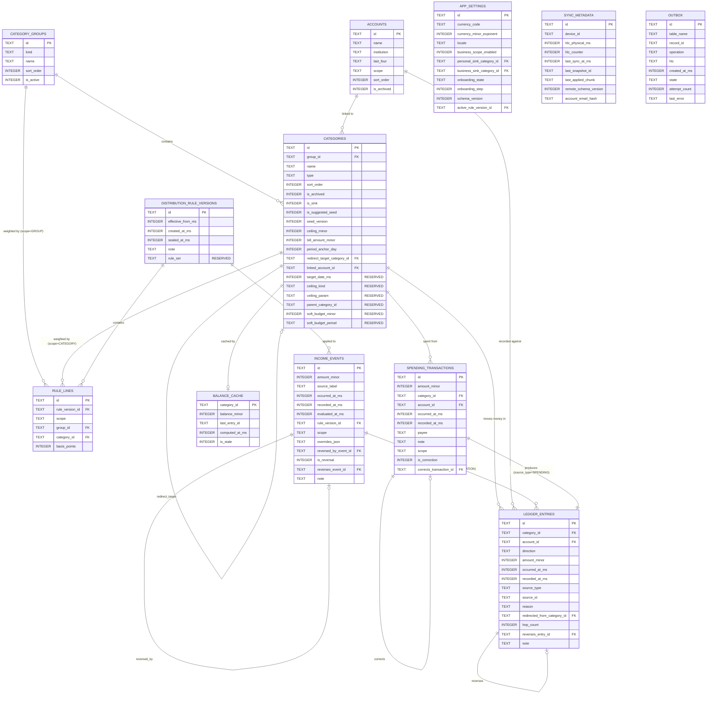

# PookieBudget — data design

| | |
|---|---|
| **Status** | In progress — Stage 2 |
| **Derived from** | `docs/PRD.md` §4 (money model) and §5 (stories); `ARCHITECTURE.md` |
| **Sections assembled** | 1, 2, 3, 4 (substage 2.3) |
| **Sections pending** | 5, 7 (2.4); 6 (2.10); 8 (2.9) |

Stage 4 transcribes this document **exactly** and proves the transcription faithful with a
comparison table. A divergence invalidates the Stage 2 design review silently, so any change here
after approval requires an ADR.

**Vocabulary:** PRD §9 glossary terms only.

---

## 1. Conventions binding every table

These are not per-column decisions; they apply everywhere and are enforced mechanically.

| # | Convention | Enforced by |
|---|---|---|
| S-01 | **Money is `INTEGER`, in the currency's minor unit, int64.** No `REAL`, `FLOAT`, `NUMERIC` or `DECIMAL` column exists anywhere in the database. | Guard G3; runtime schema check S04.3.6 |
| S-02 | **Percentages are `INTEGER` basis points**, 0–10000. One hundredth of one percent. | Check constraint §5; `BasisPoints` value type |
| S-03 | **Timestamps are `INTEGER` UTC epoch milliseconds.** Never text, never local time. | INV-09; guard G4 |
| S-04 | **Primary keys are `TEXT` client-generated UUIDs.** No auto-increment integer anywhere. | INV-12; ARCHITECTURE §8.6 |
| S-05 | **Enumerations are stored as stable `TEXT`**, never ordinals, so reordering an enum in code cannot corrupt data. | §4; round-trip test S04.2.3 |
| S-06 | **Deletion is soft.** Every synced table carries a tombstone; no code path hard-deletes a synced row. | INV-10; S04.4.3 |
| S-07 | **Every synced table carries the five sync columns** (§2.1). | S04.3.2 |
| S-08 | Booleans are `INTEGER` 0/1, since SQLite has no boolean type. | — |

### 1.1 Naming

Tables are `snake_case` plural. Columns are `snake_case`. Money columns end `_minor`. Timestamp
columns end `_ms`. Basis-point columns end `_bp`. Boolean columns begin `is_` or `has_`.

---

## 2. Table inventory

Twelve tables. Nine are synced; three are device-local and never leave the device.

| Table | Purpose | Synced | Mutable |
|---|---|---|---|
| `category_groups` | The three top-level buckets | ✅ | ✅ |
| `categories` | Destinations for money | ✅ | ✅ |
| `accounts` | Real-world account labels | ✅ | ✅ |
| `distribution_rule_versions` | Effective-dated percentage sets | ✅ | append-mostly |
| `rule_lines` | The percentages within a rule version | ✅ | ❌ immutable once its version is sealed |
| `income_events` | An inbound sum that triggered a distribution | ✅ | ❌ immutable |
| `ledger_entries` | Every movement of money | ✅ | ❌ **append-only** (INV-03) |
| `spending_transactions` | The user-facing record behind a spending ledger entry | ✅ | ❌ immutable |
| `app_settings` | Currency, scope, sink ids, onboarding state | ✅ | ✅ |
| `sync_metadata` | Device id, HLC state, last sync, remote pointers | ❌ device-local | ✅ |
| `outbox` | Local changes awaiting push | ❌ device-local | ✅ |
| `balance_cache` | Materialised balances — a cache, never a source of truth | ❌ device-local | ✅ |

### 2.1 The five sync columns

Every synced table carries these, without exception (S-07):

| Column | Type | Null | Meaning |
|---|---|---|---|
| `updated_at_ms` | INTEGER | no | Wall-clock time of the last write, UTC epoch ms. **For display and diagnostics only — never for ordering.** |
| `updated_by_device` | TEXT | no | The device id that last wrote this row |
| `hlc` | TEXT | no | Hybrid logical clock, lexicographically sortable. **This is what orders concurrent edits** (R-08) |
| `is_deleted` | INTEGER | no, default 0 | Tombstone flag |
| `deleted_at_ms` | INTEGER | yes | When the tombstone was set; null when `is_deleted` is 0 |

**Why both `updated_at_ms` and `hlc` exist.** They are not redundant. `updated_at_ms` answers "when
did this happen?" for a human reading a diagnostic. `hlc` answers "which of two concurrent edits
wins?" A device with a wrong clock produces a misleading `updated_at_ms` but still orders correctly
by `hlc`. **Merge logic reads `hlc` only** — substage 7.4's rule "never compare raw wall-clock
timestamps in merge logic" is why the two are separate columns rather than one.

### 2.2 Why `ledger_entries` and `spending_transactions` are separate tables

Substage 2.3.1 requires this decision and its justification.

**Decision: `ledger_entries` is the single money-movement table. `income_events` and
`spending_transactions` are *source* records that ledger entries point back to.**

The alternative — one table with a type discriminator and nullable columns for each variant's extra
fields — was rejected because:

1. A spending transaction carries user-facing fields (payee note, the account it was paid from) that
   have no meaning for an allocation line item. Folding them in creates columns that are null for
   80–89% of rows (PRD §7.3's allocation share).
2. `ledger_entries` must be **append-only with no update path at all** (INV-03, S04.5.1). A spending
   transaction's *description* is something a user might reasonably correct. Separating them lets the
   ledger stay strictly immutable while a correction is expressed as a compensating entry plus a new
   pair — which is exactly the behaviour PRD §4.8 promises.
3. Merge semantics differ per record class (substage 2.9.4). Ledger entries merge by union on UUID
   and can never conflict. Keeping them in their own table makes that rule enforceable rather than
   conditional.

Every ledger entry names its source through `source_type` + `source_id`, so the join is explicit and
a future source kind (a transfer, deferred as D-07) adds a `source_type` value and its own table
without touching `ledger_entries`.

---

## 3. Table definitions

### 3.1 `category_groups`

The three top-level buckets. A table rather than an enum because each carries a percentage share and
a sort order, and because the business group can be absent entirely (PRD A-20).

| Column | Type | Null | Default | Meaning |
|---|---|---|---|---|
| `id` | TEXT | no | — | UUID v4, primary key |
| `kind` | TEXT | no | — | `SPENDING` \| `SAVINGS` \| `BUSINESS`. Unique among non-deleted rows |
| `name` | TEXT | no | — | Display name; user-renameable |
| `sort_order` | INTEGER | no | — | Display order, and the deterministic tie-break key for allocation |
| `is_active` | INTEGER | no | 1 | A personal-only user has no BUSINESS row at all; this flag covers the transition when business is enabled or disabled |
| *five sync columns* | | | | §2.1 |

### 3.2 `categories`

| Column | Type | Null | Default | Meaning |
|---|---|---|---|---|
| `id` | TEXT | no | — | UUID v4, primary key |
| `group_id` | TEXT | no | — | → `category_groups.id` |
| `name` | TEXT | no | — | Unique within its group among non-archived, non-deleted rows |
| `type` | TEXT | no | — | `FIXED_RECURRING` \| `ACCUMULATING_RESERVE` \| `UNCAPPED_FLOW` |
| `sort_order` | INTEGER | no | — | Display order **and** the first allocation tie-break key |
| `is_archived` | INTEGER | no | 0 | Archived: hidden from pickers, history preserved. Distinct from deleted |
| `is_sink` | INTEGER | no | 0 | The terminal catch-all. Non-deletable, non-archivable, must be uncapped |
| `is_suggested_seed` | INTEGER | no | 0 | Distinguishes an untouched suggestion from a user creation |
| `seed_version` | INTEGER | yes | null | Which seed generation produced it; null for user creations |
| `ceiling_minor` | INTEGER | yes | null | Target amount. Required when `type = ACCUMULATING_RESERVE`, must be null otherwise |
| `bill_amount_minor` | INTEGER | yes | null | Per-period bill. Required when `type = FIXED_RECURRING`, null otherwise |
| `period_anchor_day` | INTEGER | yes | null | 1–31. Required when `type = FIXED_RECURRING`, null otherwise |
| `redirect_target_category_id` | TEXT | yes | null | Self-reference → `categories.id`. Where overflow goes |
| `linked_account_id` | TEXT | yes | null | → `accounts.id`. At most one (PRD A-08) |
| **`target_date_ms`** | INTEGER | yes | null | **RESERVED, UNUSED in v1.** Accommodation for deferral D-01 (OQ-04). Written by nothing, read by nothing; present so adding deadline-driven goals later is not a migration |
| **`ceiling_kind`** | TEXT | no | `'ABSOLUTE'` | **RESERVED.** `ABSOLUTE` is the only value v1 writes or accepts. Accommodation for D-02 (derived ceilings, escalation E-03) |
| **`ceiling_param`** | TEXT | yes | null | **RESERVED, UNUSED in v1.** The parameter a non-absolute ceiling kind would need |
| **`parent_category_id`** | TEXT | yes | null | **RESERVED, UNUSED in v1.** Self-reference. Accommodation for D-03 (nesting, OQ-12 answered *flat*) |
| **`soft_budget_minor`** | INTEGER | yes | null | **RESERVED, UNUSED in v1.** Accommodation for D-05 (soft envelope budgets) |
| **`soft_budget_period`** | TEXT | yes | null | **RESERVED, UNUSED in v1.** Companion to the above |
| *five sync columns* | | | | §2.1 |

**The six reserved columns are the schema accommodations promised in PRD §3.4.** They are documented
as reserved, validated as unused (substage 2.10 rejects any non-default value), and carried in
exports so a v1.1 client reading a v1.0 backup finds them present. This is the debt PRD §3.4 said
would be paid here.

### 3.3 `accounts`

Under OQ-02's answer, an account is a **label with a derived total** — there is no account balance
column, and there is no transfer table. The account's total is computed as the sum of its linked
categories' balances.

| Column | Type | Null | Default | Meaning |
|---|---|---|---|---|
| `id` | TEXT | no | — | UUID v4, primary key |
| `name` | TEXT | no | — | Unique among non-archived, non-deleted rows |
| `institution` | TEXT | yes | null | Bank name, free text |
| `last_four` | TEXT | yes | null | Last four digits, free text, purely a memory aid |
| `scope` | TEXT | no | `'PERSONAL'` | `PERSONAL` \| `BUSINESS`. Keeps a business account from appearing in personal flows |
| `sort_order` | INTEGER | no | — | Display order |
| `is_archived` | INTEGER | no | 0 | |
| *five sync columns* | | | | §2.1 |

> **No `balance_minor` column exists on `accounts`, deliberately.** Adding one would create a second
> source of truth for money and break INV-04. If OQ-02 is ever revisited toward real account
> balances, the accommodation is already present: `ledger_entries.account_id` records which account
> each movement touched, so per-account movement is derivable from v1.0 without a migration
> (PRD §3.4 D-14).

### 3.4 `distribution_rule_versions`

INV-11: a historical income event must stay explainable against the rules in force when it was
applied, even after the user changes their percentages.

| Column | Type | Null | Default | Meaning |
|---|---|---|---|---|
| `id` | TEXT | no | — | UUID v4, primary key |
| `effective_from_ms` | INTEGER | no | — | When this version became active |
| `created_at_ms` | INTEGER | no | — | When it was written |
| `sealed_at_ms` | INTEGER | yes | null | When it stopped being editable — set the moment its first income event is recorded |
| `note` | TEXT | yes | null | Optional user note: "raised savings to 35%" |
| **`rule_set`** | TEXT | no | `'DEFAULT'` | **RESERVED.** `DEFAULT` is the only value v1 writes. Accommodation for D-06 (per-source rules) after OQ-11 was answered *one rule set for all income* |
| *five sync columns* | | | | §2.1 |

**`sealed_at_ms` is load-bearing.** Once an income event references a rule version, that version's
lines can never change — otherwise history would silently re-derive and INV-11 would break. Editing
percentages after that point creates a **new** version; it never mutates the sealed one.

### 3.5 `rule_lines`

| Column | Type | Null | Default | Meaning |
|---|---|---|---|---|
| `id` | TEXT | no | — | UUID v4, primary key |
| `rule_version_id` | TEXT | no | — | → `distribution_rule_versions.id` |
| `scope` | TEXT | no | — | `GROUP` \| `CATEGORY` |
| `group_id` | TEXT | yes | null | Set when `scope = GROUP`; null otherwise |
| `category_id` | TEXT | yes | null | Set when `scope = CATEGORY`; null otherwise |
| `basis_points` | INTEGER | no | — | 0–10000 |
| *five sync columns* | | | | §2.1 |

Both levels of the two-level split (PRD A-16) live in one table, discriminated by `scope`: `GROUP`
lines must total exactly 10000 across the active groups, and `CATEGORY` lines must total exactly
10000 within each group that has a non-zero share.

### 3.6 `income_events`

| Column | Type | Null | Default | Meaning |
|---|---|---|---|---|
| `id` | TEXT | no | — | UUID v7, primary key |
| `amount_minor` | INTEGER | no | — | The conservation target: ledger entries for this event must sum to exactly this |
| `source_label` | TEXT | yes | null | "Salary", "Sale — order 412" |
| `occurred_at_ms` | INTEGER | no | — | When the money arrived, per the user |
| `recorded_at_ms` | INTEGER | no | — | When the app was told |
| `evaluated_at_ms` | INTEGER | no | — | The timestamp passed into the engine. Stored so the event is exactly reproducible (INV-08) |
| `rule_version_id` | TEXT | no | — | → the version actually applied (INV-11) |
| `scope` | TEXT | no | `'PERSONAL'` | `PERSONAL` \| `BUSINESS`, for reporting scope |
| **`overrides_json`** | TEXT | yes | null | The manual override map as supplied, or null. **An input to the event, not an edit of its output** — see below |
| `reversed_by_event_id` | TEXT | yes | null | → the reversal event that undid this one, if any |
| `is_reversal` | INTEGER | no | 0 | 1 when this event *is* a reversal of another |
| `reverses_event_id` | TEXT | yes | null | → the event this one reverses |
| `note` | TEXT | yes | null | |
| *five sync columns* | | | | §2.1 |

**`overrides_json` implements assumption A-23 and closes escalation E-02.** INV-08 requires that
identical inputs produce byte-identical output. A manual override changes an event's outcome without
changing rules or balances — so unless the override is stored as part of the event's *input*, the
event becomes unreproducible and INV-11's promise that history stays explainable breaks. Storing it
here means the full input tuple is recoverable: amount, `evaluated_at_ms`, `rule_version_id`,
`overrides_json`, plus the balances derivable from entries preceding this event.

It is `TEXT` holding JSON of `{category_id: amount_minor}` with integer values. It is a **verbatim
record of user input**, never a computed result — the computed result is the ledger entries.

### 3.7 `ledger_entries` — append-only

The immutable record of every movement. **This table has no update path and no delete path at any
layer** (INV-03, S04.5.1). Corrections are new compensating rows.

| Column | Type | Null | Default | Meaning |
|---|---|---|---|---|
| `id` | TEXT | no | — | UUID v7, primary key. Idempotency key: inserting the same id twice is a no-op |
| `category_id` | TEXT | no | — | → `categories.id`. Which category moved |
| `account_id` | TEXT | yes | null | → `accounts.id`. Denormalised from the category at write time, so history survives a later re-link |
| `direction` | TEXT | no | — | `IN` \| `OUT` |
| `amount_minor` | INTEGER | no | — | Always **positive**; `direction` carries the sign. A signed amount plus a direction gives two ways to express the same thing and eventually they disagree |
| `occurred_at_ms` | INTEGER | no | — | |
| `recorded_at_ms` | INTEGER | no | — | |
| `source_type` | TEXT | no | — | `ALLOCATION` \| `SPENDING` \| `REVERSAL` \| `ADJUSTMENT` |
| `source_id` | TEXT | no | — | → the income event or spending transaction that produced it |
| `reason` | TEXT | yes | null | `BASE` \| `REDIRECT` \| `MANUAL_OVERRIDE` \| `SINK_TERMINAL`. Set for allocations |
| `redirected_from_category_id` | TEXT | yes | null | → `categories.id`. Set when `reason = REDIRECT`; **this is what lets the UI say where overflow came from** |
| `hop_count` | INTEGER | yes | null | How many redirects this parcel travelled. 0 for a base allocation |
| `reverses_entry_id` | TEXT | yes | null | → the entry this one compensates |
| `note` | TEXT | yes | null | |
| *five sync columns* | | | | §2.1 |

**On `is_deleted` for an append-only table.** The column is present for structural uniformity (S-07)
and because the sync merge reads it, but **it is never set to 1 for a ledger entry**. A validation
rule (§6, substage 2.10) rejects any ledger row with `is_deleted = 1`, and the merge treats such a
row as corruption rather than a deletion. Deleting money movement is exactly what INV-03 forbids.

**On `account_id` being denormalised.** It is copied from the category at write time rather than
joined at read time. If the user re-links a category to a different account next year, last year's
entries must still report the account the money actually went to. A join would rewrite history.

### 3.8 `spending_transactions`

The user-facing record behind an outgoing movement. One row produces exactly one `OUT` ledger entry.

| Column | Type | Null | Default | Meaning |
|---|---|---|---|---|
| `id` | TEXT | no | — | UUID v7, primary key |
| `amount_minor` | INTEGER | no | — | Positive |
| `category_id` | TEXT | no | — | → `categories.id` |
| `account_id` | TEXT | yes | null | Defaulted from the category's link, overridable |
| `occurred_at_ms` | INTEGER | no | — | |
| `recorded_at_ms` | INTEGER | no | — | |
| `payee` | TEXT | yes | null | |
| `note` | TEXT | yes | null | |
| `scope` | TEXT | no | `'PERSONAL'` | `PERSONAL` \| `BUSINESS` |
| `is_correction` | INTEGER | no | 0 | 1 when this replaces a corrected entry |
| `corrects_transaction_id` | TEXT | yes | null | → the transaction being corrected |
| *five sync columns* | | | | §2.1 |

A correction writes three rows: a compensating ledger entry cancelling the original, a new
transaction, and its ledger entry. The original stays visible (PRD §4.8, US-026).

### 3.9 `app_settings`

Single-row table. `id` is fixed at `'singleton'` so a merge cannot produce two.

| Column | Type | Null | Default | Meaning |
|---|---|---|---|---|
| `id` | TEXT | no | `'singleton'` | Constant |
| `currency_code` | TEXT | no | — | ISO 4217, e.g. `PKR`, `USD`, `JPY`, `KWD` |
| `currency_minor_exponent` | INTEGER | no | — | 0, 2 or 3. Drives all parsing and formatting. **Immutable once any ledger entry exists** |
| `locale` | TEXT | no | — | For display formatting |
| `business_scope_enabled` | INTEGER | no | 0 | |
| `personal_sink_category_id` | TEXT | yes | null | → `categories.id`. Required once onboarding completes |
| `business_sink_category_id` | TEXT | yes | null | → `categories.id`. Required when business scope is enabled |
| `onboarding_state` | TEXT | no | `'NOT_STARTED'` | `NOT_STARTED` \| `IN_PROGRESS` \| `COMPLETE`. Enables resume-where-you-left-off (S06.2.4) |
| `onboarding_step` | INTEGER | yes | null | Which step, when in progress |
| `schema_version` | INTEGER | no | — | The database schema version |
| `active_rule_version_id` | TEXT | yes | null | → the currently effective rule version |
| *five sync columns* | | | | §2.1 |

### 3.10 `sync_metadata` — device-local, never synced

| Column | Type | Null | Meaning |
|---|---|---|---|
| `id` | TEXT | no | `'singleton'` |
| `device_id` | TEXT | no | Generated once at install. **Never derived from a hardware identifier** (S07.4.4) |
| `hlc_physical_ms` | INTEGER | no | Persisted HLC state, so it never goes backwards across a restart |
| `hlc_counter` | INTEGER | no | |
| `last_sync_at_ms` | INTEGER | yes | |
| `last_snapshot_id` | TEXT | yes | |
| `last_applied_chunk` | TEXT | yes | |
| `remote_schema_version` | INTEGER | yes | |
| `account_email_hash` | TEXT | yes | A hash, not the address — used only to detect an account switch |

This table is device-local by design: syncing a device's own clock state to other devices would be
meaningless at best and corrupting at worst.

### 3.11 `outbox` — device-local

| Column | Type | Null | Meaning |
|---|---|---|---|
| `id` | TEXT | no | UUID v7 |
| `table_name` | TEXT | no | Which table the change touched |
| `record_id` | TEXT | no | Which row |
| `operation` | TEXT | no | `UPSERT` \| `TOMBSTONE` |
| `hlc` | TEXT | no | The HLC of the change |
| `created_at_ms` | INTEGER | no | |
| `state` | TEXT | no | `PENDING` \| `IN_FLIGHT` \| `FAILED` |
| `attempt_count` | INTEGER | no | Drives backoff |
| `last_error` | TEXT | yes | Error **type**, never a payload — ARCHITECTURE §8.2 |

Written in the **same transaction** as the mutation it describes (S07.7.1); otherwise a crash
between the two loses the change silently.

### 3.12 `balance_cache` — device-local, derived, disposable

| Column | Type | Null | Meaning |
|---|---|---|---|
| `category_id` | TEXT | no | → `categories.id`, primary key |
| `balance_minor` | INTEGER | no | Cached sum of the category's ledger entries |
| `last_entry_id` | TEXT | yes | The most recent entry folded in |
| `computed_at_ms` | INTEGER | no | |
| `is_stale` | INTEGER | no | Set on any write to that category's entries |

**This is a cache and never a source of truth** (INV-04). It is device-local and excluded from sync
precisely so a merge can never import a balance — balances are always recomputed locally from
entries. The full policy, including the recompute-and-compare verifier and when it runs, is
substage 2.4.5's; this section only declares the table.

---

## 4. Enumerations

All stored as stable `TEXT` (S-05). Adding a value later is additive; **renaming or removing one is a
migration**. Any value not listed is invalid and rejected at the mapper boundary.

| Enumeration | Values | Used by |
|---|---|---|
| `CategoryGroupKind` | `SPENDING`, `SAVINGS`, `BUSINESS` | `category_groups.kind` |
| `CategoryType` | `FIXED_RECURRING`, `ACCUMULATING_RESERVE`, `UNCAPPED_FLOW` | `categories.type` |
| `LedgerDirection` | `IN`, `OUT` | `ledger_entries.direction` |
| `LedgerSourceType` | `ALLOCATION`, `SPENDING`, `REVERSAL`, `ADJUSTMENT` | `ledger_entries.source_type` |
| `AllocationReason` | `BASE`, `REDIRECT`, `MANUAL_OVERRIDE`, `SINK_TERMINAL` | `ledger_entries.reason` |
| `RuleLineScope` | `GROUP`, `CATEGORY` | `rule_lines.scope` |
| `MoneyScope` | `PERSONAL`, `BUSINESS` | `accounts.scope`, `income_events.scope`, `spending_transactions.scope` |
| `OnboardingState` | `NOT_STARTED`, `IN_PROGRESS`, `COMPLETE` | `app_settings.onboarding_state` |
| `OutboxOperation` | `UPSERT`, `TOMBSTONE` | `outbox.operation` |
| `OutboxState` | `PENDING`, `IN_FLIGHT`, `FAILED` | `outbox.state` |
| `CeilingKind` | `ABSOLUTE` *(only value v1 writes)* | `categories.ceiling_kind` — reserved, D-02 |
| `RuleSet` | `DEFAULT` *(only value v1 writes)* | `distribution_rule_versions.rule_set` — reserved, D-06 |

`UNCAPPED_FLOW` exists because OQ-03 was answered **yes**; the six seeded categories typed that way
are valid.

---

## 4.1 Entity relationship diagram

Matches §3 exactly. Sync columns are omitted from the diagram for legibility — every synced entity
carries all five per §2.1.

### 4.2 Verification against substage 2.3's acceptance criteria

| Criterion | Evidence |
|---|---|
| No column stores money or a percentage as real, double, float or numeric | Every money column is `INTEGER … _minor`; every percentage is `INTEGER … basis_points`. Convention S-01/S-02; runtime check S04.3.6 reads the live schema |
| Every synced table carries the five sync columns | §2.1 applies to all nine synced tables. The three device-local tables are named in §2 with the reason each is excluded |
| The ledger table has no design affordance for update or delete | §3.7: no update path at any layer; `is_deleted` documented as never set, with validation rejecting it |
| Every enumeration lists its permitted values and is stored as a stable string | §4 — twelve enumerations, values enumerated, S-05 |
| The ER diagram renders and matches the written schema | §4.1, generated from §3 field by field |
| `target_date` present and documented as reserved | §3.2 — plus five further reserved columns delivering all six PRD §3.4 accommodations |
