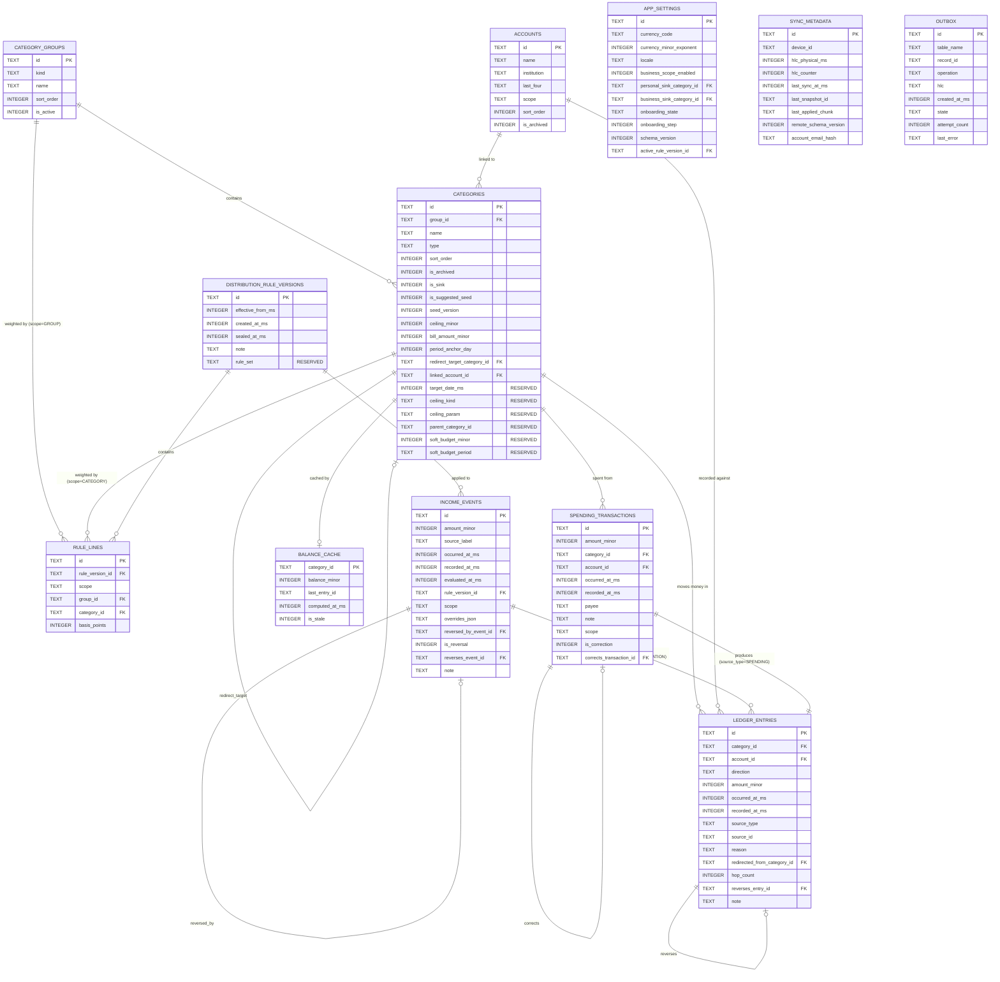

# PookieBudget — data design

| | |
|---|---|
| **Status** | In progress — Stage 2 |
| **Derived from** | `docs/PRD.md` §4 (money model) and §5 (stories); `ARCHITECTURE.md` |
| **Sections assembled** | 1, 2, 3, 4 (2.3); 5, 7 (2.4) |
| **Sections pending** | 6 (2.10); 8 (2.9) |

Stage 4 transcribes this document **exactly** and proves the transcription faithful with a
comparison table. A divergence invalidates the Stage 2 design review silently, so any change here
after approval requires an ADR.

**Vocabulary:** PRD §9 glossary terms only.

---

## 1. Conventions binding every table

These are not per-column decisions; they apply everywhere and are enforced mechanically.

| # | Convention | Enforced by |
|---|---|---|
| S-01 | **Money is `INTEGER`, in the currency's minor unit, int64.** No `REAL`, `FLOAT`, `NUMERIC` or `DECIMAL` column exists anywhere in the database. | Guard G3; runtime schema check S04.3.6 |
| S-02 | **Percentages are `INTEGER` basis points**, 0–10000. One hundredth of one percent. | Check constraint §5; `BasisPoints` value type |
| S-03 | **Timestamps are `INTEGER` UTC epoch milliseconds.** Never text, never local time. | INV-09; guard G4 |
| S-04 | **Primary keys are `TEXT` client-generated UUIDs.** No auto-increment integer anywhere. | INV-12; ARCHITECTURE §8.6 |
| S-05 | **Enumerations are stored as stable `TEXT`**, never ordinals, so reordering an enum in code cannot corrupt data. | §4; round-trip test S04.2.3 |
| S-06 | **Deletion is soft.** Every synced table carries a tombstone; no code path hard-deletes a synced row. | INV-10; S04.4.3 |
| S-07 | **Every synced table carries the five sync columns** (§2.1). | S04.3.2 |
| S-08 | Booleans are `INTEGER` 0/1, since SQLite has no boolean type. | — |

### 1.1 Naming

Tables are `snake_case` plural. Columns are `snake_case`. Money columns end `_minor`. Timestamp
columns end `_ms`. Basis-point columns end `_bp`. Boolean columns begin `is_` or `has_`.

---

## 2. Table inventory

Twelve tables. Nine are synced; three are device-local and never leave the device.

| Table | Purpose | Synced | Mutable |
|---|---|---|---|
| `category_groups` | The three top-level buckets | ✅ | ✅ |
| `categories` | Destinations for money | ✅ | ✅ |
| `accounts` | Real-world account labels | ✅ | ✅ |
| `distribution_rule_versions` | Effective-dated percentage sets | ✅ | append-mostly |
| `rule_lines` | The percentages within a rule version | ✅ | ❌ immutable once its version is sealed |
| `income_events` | An inbound sum that triggered a distribution | ✅ | ❌ immutable |
| `ledger_entries` | Every movement of money | ✅ | ❌ **append-only** (INV-03) |
| `spending_transactions` | The user-facing record behind a spending ledger entry | ✅ | ❌ immutable |
| `app_settings` | Currency, scope, sink ids, onboarding state | ✅ | ✅ |
| `sync_metadata` | Device id, HLC state, last sync, remote pointers | ❌ device-local | ✅ |
| `outbox` | Local changes awaiting push | ❌ device-local | ✅ |
| `balance_cache` | Materialised balances — a cache, never a source of truth | ❌ device-local | ✅ |

### 2.1 The five sync columns

Every synced table carries these, without exception (S-07):

| Column | Type | Null | Meaning |
|---|---|---|---|
| `updated_at_ms` | INTEGER | no | Wall-clock time of the last write, UTC epoch ms. **For display and diagnostics only — never for ordering.** |
| `updated_by_device` | TEXT | no | The device id that last wrote this row |
| `hlc` | TEXT | no | Hybrid logical clock, lexicographically sortable. **This is what orders concurrent edits** (R-08) |
| `is_deleted` | INTEGER | no, default 0 | Tombstone flag |
| `deleted_at_ms` | INTEGER | yes | When the tombstone was set; null when `is_deleted` is 0 |

**Why both `updated_at_ms` and `hlc` exist.** They are not redundant. `updated_at_ms` answers "when
did this happen?" for a human reading a diagnostic. `hlc` answers "which of two concurrent edits
wins?" A device with a wrong clock produces a misleading `updated_at_ms` but still orders correctly
by `hlc`. **Merge logic reads `hlc` only** — substage 7.4's rule "never compare raw wall-clock
timestamps in merge logic" is why the two are separate columns rather than one.

### 2.2 Why `ledger_entries` and `spending_transactions` are separate tables

Substage 2.3.1 requires this decision and its justification.

**Decision: `ledger_entries` is the single money-movement table. `income_events` and
`spending_transactions` are *source* records that ledger entries point back to.**

The alternative — one table with a type discriminator and nullable columns for each variant's extra
fields — was rejected because:

1. A spending transaction carries user-facing fields (payee note, the account it was paid from) that
   have no meaning for an allocation line item. Folding them in creates columns that are null for
   80–89% of rows (PRD §7.3's allocation share).
2. `ledger_entries` must be **append-only with no update path at all** (INV-03, S04.5.1). A spending
   transaction's *description* is something a user might reasonably correct. Separating them lets the
   ledger stay strictly immutable while a correction is expressed as a compensating entry plus a new
   pair — which is exactly the behaviour PRD §4.8 promises.
3. Merge semantics differ per record class (substage 2.9.4). Ledger entries merge by union on UUID
   and can never conflict. Keeping them in their own table makes that rule enforceable rather than
   conditional.

Every ledger entry names its source through `source_type` + `source_id`, so the join is explicit and
a future source kind (a transfer, deferred as D-07) adds a `source_type` value and its own table
without touching `ledger_entries`.

---

## 3. Table definitions

### 3.1 `category_groups`

The three top-level buckets. A table rather than an enum because each carries a percentage share and
a sort order, and because the business group can be absent entirely (PRD A-20).

| Column | Type | Null | Default | Meaning |
|---|---|---|---|---|
| `id` | TEXT | no | — | UUID v4, primary key |
| `kind` | TEXT | no | — | `SPENDING` \| `SAVINGS` \| `BUSINESS`. Unique among non-deleted rows |
| `name` | TEXT | no | — | Display name; user-renameable |
| `sort_order` | INTEGER | no | — | Display order, and the deterministic tie-break key for allocation |
| `is_active` | INTEGER | no | 1 | A personal-only user has no BUSINESS row at all; this flag covers the transition when business is enabled or disabled |
| *five sync columns* | | | | §2.1 |

### 3.2 `categories`

| Column | Type | Null | Default | Meaning |
|---|---|---|---|---|
| `id` | TEXT | no | — | UUID v4, primary key |
| `group_id` | TEXT | no | — | → `category_groups.id` |
| `name` | TEXT | no | — | Unique within its group among non-archived, non-deleted rows |
| `type` | TEXT | no | — | `FIXED_RECURRING` \| `ACCUMULATING_RESERVE` \| `UNCAPPED_FLOW` |
| `sort_order` | INTEGER | no | — | Display order **and** the first allocation tie-break key |
| `is_archived` | INTEGER | no | 0 | Archived: hidden from pickers, history preserved. Distinct from deleted |
| `is_sink` | INTEGER | no | 0 | The terminal catch-all. Non-deletable, non-archivable, must be uncapped |
| `is_suggested_seed` | INTEGER | no | 0 | Distinguishes an untouched suggestion from a user creation |
| `seed_version` | INTEGER | yes | null | Which seed generation produced it; null for user creations |
| `ceiling_minor` | INTEGER | yes | null | Target amount. Required when `type = ACCUMULATING_RESERVE`, must be null otherwise |
| `bill_amount_minor` | INTEGER | yes | null | Per-period bill. Required when `type = FIXED_RECURRING`, null otherwise |
| `period_anchor_day` | INTEGER | yes | null | 1–31. Required when `type = FIXED_RECURRING`, null otherwise |
| `redirect_target_category_id` | TEXT | yes | null | Self-reference → `categories.id`. Where overflow goes |
| `linked_account_id` | TEXT | yes | null | → `accounts.id`. At most one (PRD A-08) |
| **`target_date_ms`** | INTEGER | yes | null | **RESERVED, UNUSED in v1.** Accommodation for deferral D-01 (OQ-04). Written by nothing, read by nothing; present so adding deadline-driven goals later is not a migration |
| **`ceiling_kind`** | TEXT | no | `'ABSOLUTE'` | **RESERVED.** `ABSOLUTE` is the only value v1 writes or accepts. Accommodation for D-02 (derived ceilings, escalation E-03) |
| **`ceiling_param`** | TEXT | yes | null | **RESERVED, UNUSED in v1.** The parameter a non-absolute ceiling kind would need |
| **`parent_category_id`** | TEXT | yes | null | **RESERVED, UNUSED in v1.** Self-reference. Accommodation for D-03 (nesting, OQ-12 answered *flat*) |
| **`soft_budget_minor`** | INTEGER | yes | null | **RESERVED, UNUSED in v1.** Accommodation for D-05 (soft envelope budgets) |
| **`soft_budget_period`** | TEXT | yes | null | **RESERVED, UNUSED in v1.** Companion to the above |
| *five sync columns* | | | | §2.1 |

**The six reserved columns are the schema accommodations promised in PRD §3.4.** They are documented
as reserved, validated as unused (substage 2.10 rejects any non-default value), and carried in
exports so a v1.1 client reading a v1.0 backup finds them present. This is the debt PRD §3.4 said
would be paid here.

### 3.3 `accounts`

Under OQ-02's answer, an account is a **label with a derived total** — there is no account balance
column, and there is no transfer table. The account's total is computed as the sum of its linked
categories' balances.

| Column | Type | Null | Default | Meaning |
|---|---|---|---|---|
| `id` | TEXT | no | — | UUID v4, primary key |
| `name` | TEXT | no | — | Unique among non-archived, non-deleted rows |
| `institution` | TEXT | yes | null | Bank name, free text |
| `last_four` | TEXT | yes | null | Last four digits, free text, purely a memory aid |
| `scope` | TEXT | no | `'PERSONAL'` | `PERSONAL` \| `BUSINESS`. Keeps a business account from appearing in personal flows |
| `sort_order` | INTEGER | no | — | Display order |
| `is_archived` | INTEGER | no | 0 | |
| *five sync columns* | | | | §2.1 |

> **No `balance_minor` column exists on `accounts`, deliberately.** Adding one would create a second
> source of truth for money and break INV-04. If OQ-02 is ever revisited toward real account
> balances, the accommodation is already present: `ledger_entries.account_id` records which account
> each movement touched, so per-account movement is derivable from v1.0 without a migration
> (PRD §3.4 D-14).

### 3.4 `distribution_rule_versions`

INV-11: a historical income event must stay explainable against the rules in force when it was
applied, even after the user changes their percentages.

| Column | Type | Null | Default | Meaning |
|---|---|---|---|---|
| `id` | TEXT | no | — | UUID v4, primary key |
| `effective_from_ms` | INTEGER | no | — | When this version became active |
| `created_at_ms` | INTEGER | no | — | When it was written |
| `sealed_at_ms` | INTEGER | yes | null | When it stopped being editable — set the moment its first income event is recorded |
| `note` | TEXT | yes | null | Optional user note: "raised savings to 35%" |
| **`rule_set`** | TEXT | no | `'DEFAULT'` | **RESERVED.** `DEFAULT` is the only value v1 writes. Accommodation for D-06 (per-source rules) after OQ-11 was answered *one rule set for all income* |
| *five sync columns* | | | | §2.1 |

**`sealed_at_ms` is load-bearing.** Once an income event references a rule version, that version's
lines can never change — otherwise history would silently re-derive and INV-11 would break. Editing
percentages after that point creates a **new** version; it never mutates the sealed one.

### 3.5 `rule_lines`

| Column | Type | Null | Default | Meaning |
|---|---|---|---|---|
| `id` | TEXT | no | — | UUID v4, primary key |
| `rule_version_id` | TEXT | no | — | → `distribution_rule_versions.id` |
| `scope` | TEXT | no | — | `GROUP` \| `CATEGORY` |
| `group_id` | TEXT | yes | null | Set when `scope = GROUP`; null otherwise |
| `category_id` | TEXT | yes | null | Set when `scope = CATEGORY`; null otherwise |
| `basis_points` | INTEGER | no | — | 0–10000 |
| *five sync columns* | | | | §2.1 |

Both levels of the two-level split (PRD A-16) live in one table, discriminated by `scope`: `GROUP`
lines must total exactly 10000 across the active groups, and `CATEGORY` lines must total exactly
10000 within each group that has a non-zero share.

### 3.6 `income_events`

| Column | Type | Null | Default | Meaning |
|---|---|---|---|---|
| `id` | TEXT | no | — | UUID v7, primary key |
| `amount_minor` | INTEGER | no | — | The conservation target: ledger entries for this event must sum to exactly this |
| `source_label` | TEXT | yes | null | "Salary", "Sale — order 412" |
| `occurred_at_ms` | INTEGER | no | — | When the money arrived, per the user |
| `recorded_at_ms` | INTEGER | no | — | When the app was told |
| `evaluated_at_ms` | INTEGER | no | — | The timestamp passed into the engine. Stored so the event is exactly reproducible (INV-08) |
| `rule_version_id` | TEXT | no | — | → the version actually applied (INV-11) |
| `scope` | TEXT | no | `'PERSONAL'` | `PERSONAL` \| `BUSINESS`, for reporting scope |
| **`overrides_json`** | TEXT | yes | null | The manual override map as supplied, or null. **An input to the event, not an edit of its output** — see below |
| `reversed_by_event_id` | TEXT | yes | null | → the reversal event that undid this one, if any |
| `is_reversal` | INTEGER | no | 0 | 1 when this event *is* a reversal of another |
| `reverses_event_id` | TEXT | yes | null | → the event this one reverses |
| `note` | TEXT | yes | null | |
| *five sync columns* | | | | §2.1 |

**`overrides_json` implements assumption A-23 and closes escalation E-02.** INV-08 requires that
identical inputs produce byte-identical output. A manual override changes an event's outcome without
changing rules or balances — so unless the override is stored as part of the event's *input*, the
event becomes unreproducible and INV-11's promise that history stays explainable breaks. Storing it
here means the full input tuple is recoverable: amount, `evaluated_at_ms`, `rule_version_id`,
`overrides_json`, plus the balances derivable from entries preceding this event.

It is `TEXT` holding JSON of `{category_id: amount_minor}` with integer values. It is a **verbatim
record of user input**, never a computed result — the computed result is the ledger entries.

### 3.7 `ledger_entries` — append-only

The immutable record of every movement. **This table has no update path and no delete path at any
layer** (INV-03, S04.5.1). Corrections are new compensating rows.

| Column | Type | Null | Default | Meaning |
|---|---|---|---|---|
| `id` | TEXT | no | — | UUID v7, primary key. Idempotency key: inserting the same id twice is a no-op |
| `category_id` | TEXT | no | — | → `categories.id`. Which category moved |
| `account_id` | TEXT | yes | null | → `accounts.id`. Denormalised from the category at write time, so history survives a later re-link |
| `direction` | TEXT | no | — | `IN` \| `OUT` |
| `amount_minor` | INTEGER | no | — | Always **positive**; `direction` carries the sign. A signed amount plus a direction gives two ways to express the same thing and eventually they disagree |
| `occurred_at_ms` | INTEGER | no | — | |
| `recorded_at_ms` | INTEGER | no | — | |
| `source_type` | TEXT | no | — | `ALLOCATION` \| `SPENDING` \| `REVERSAL` \| `ADJUSTMENT` |
| `source_id` | TEXT | no | — | → the income event or spending transaction that produced it |
| `reason` | TEXT | yes | null | `BASE` \| `REDIRECT` \| `MANUAL_OVERRIDE` \| `SINK_TERMINAL`. Set for allocations |
| `redirected_from_category_id` | TEXT | yes | null | → `categories.id`. Set when `reason = REDIRECT`; **this is what lets the UI say where overflow came from** |
| `hop_count` | INTEGER | yes | null | How many redirects this parcel travelled. 0 for a base allocation |
| `reverses_entry_id` | TEXT | yes | null | → the entry this one compensates |
| `note` | TEXT | yes | null | |
| *five sync columns* | | | | §2.1 |

**On `is_deleted` for an append-only table.** The column is present for structural uniformity (S-07)
and because the sync merge reads it, but **it is never set to 1 for a ledger entry**. A validation
rule (§6, substage 2.10) rejects any ledger row with `is_deleted = 1`, and the merge treats such a
row as corruption rather than a deletion. Deleting money movement is exactly what INV-03 forbids.

**On `account_id` being denormalised.** It is copied from the category at write time rather than
joined at read time. If the user re-links a category to a different account next year, last year's
entries must still report the account the money actually went to. A join would rewrite history.

### 3.8 `spending_transactions`

The user-facing record behind an outgoing movement. One row produces exactly one `OUT` ledger entry.

| Column | Type | Null | Default | Meaning |
|---|---|---|---|---|
| `id` | TEXT | no | — | UUID v7, primary key |
| `amount_minor` | INTEGER | no | — | Positive |
| `category_id` | TEXT | no | — | → `categories.id` |
| `account_id` | TEXT | yes | null | Defaulted from the category's link, overridable |
| `occurred_at_ms` | INTEGER | no | — | |
| `recorded_at_ms` | INTEGER | no | — | |
| `payee` | TEXT | yes | null | |
| `note` | TEXT | yes | null | |
| `scope` | TEXT | no | `'PERSONAL'` | `PERSONAL` \| `BUSINESS` |
| `is_correction` | INTEGER | no | 0 | 1 when this replaces a corrected entry |
| `corrects_transaction_id` | TEXT | yes | null | → the transaction being corrected |
| *five sync columns* | | | | §2.1 |

A correction writes three rows: a compensating ledger entry cancelling the original, a new
transaction, and its ledger entry. The original stays visible (PRD §4.8, US-026).

### 3.9 `app_settings`

Single-row table. `id` is fixed at `'singleton'` so a merge cannot produce two.

| Column | Type | Null | Default | Meaning |
|---|---|---|---|---|
| `id` | TEXT | no | `'singleton'` | Constant |
| `currency_code` | TEXT | no | — | ISO 4217, e.g. `PKR`, `USD`, `JPY`, `KWD` |
| `currency_minor_exponent` | INTEGER | no | — | 0, 2 or 3. Drives all parsing and formatting. **Immutable once any ledger entry exists** |
| `locale` | TEXT | no | — | For display formatting |
| `business_scope_enabled` | INTEGER | no | 0 | |
| `personal_sink_category_id` | TEXT | yes | null | → `categories.id`. Required once onboarding completes |
| `business_sink_category_id` | TEXT | yes | null | → `categories.id`. Required when business scope is enabled |
| `onboarding_state` | TEXT | no | `'NOT_STARTED'` | `NOT_STARTED` \| `IN_PROGRESS` \| `COMPLETE`. Enables resume-where-you-left-off (S06.2.4) |
| `onboarding_step` | INTEGER | yes | null | Which step, when in progress |
| `schema_version` | INTEGER | no | — | The database schema version |
| `active_rule_version_id` | TEXT | yes | null | → the currently effective rule version |
| *five sync columns* | | | | §2.1 |

### 3.10 `sync_metadata` — device-local, never synced

| Column | Type | Null | Meaning |
|---|---|---|---|
| `id` | TEXT | no | `'singleton'` |
| `device_id` | TEXT | no | Generated once at install. **Never derived from a hardware identifier** (S07.4.4) |
| `hlc_physical_ms` | INTEGER | no | Persisted HLC state, so it never goes backwards across a restart |
| `hlc_counter` | INTEGER | no | |
| `last_sync_at_ms` | INTEGER | yes | |
| `last_snapshot_id` | TEXT | yes | |
| `last_applied_chunk` | TEXT | yes | |
| `remote_schema_version` | INTEGER | yes | |
| `account_email_hash` | TEXT | yes | A hash, not the address — used only to detect an account switch |

This table is device-local by design: syncing a device's own clock state to other devices would be
meaningless at best and corrupting at worst.

### 3.11 `outbox` — device-local

| Column | Type | Null | Meaning |
|---|---|---|---|
| `id` | TEXT | no | UUID v7 |
| `table_name` | TEXT | no | Which table the change touched |
| `record_id` | TEXT | no | Which row |
| `operation` | TEXT | no | `UPSERT` \| `TOMBSTONE` |
| `hlc` | TEXT | no | The HLC of the change |
| `created_at_ms` | INTEGER | no | |
| `state` | TEXT | no | `PENDING` \| `IN_FLIGHT` \| `FAILED` |
| `attempt_count` | INTEGER | no | Drives backoff |
| `last_error` | TEXT | yes | Error **type**, never a payload — ARCHITECTURE §8.2 |

Written in the **same transaction** as the mutation it describes (S07.7.1); otherwise a crash
between the two loses the change silently.

### 3.12 `balance_cache` — device-local, derived, disposable

| Column | Type | Null | Meaning |
|---|---|---|---|
| `category_id` | TEXT | no | → `categories.id`, primary key |
| `balance_minor` | INTEGER | no | Cached sum of the category's ledger entries |
| `last_entry_id` | TEXT | yes | The most recent entry folded in |
| `computed_at_ms` | INTEGER | no | |
| `is_stale` | INTEGER | no | Set on any write to that category's entries |

**This is a cache and never a source of truth** (INV-04). It is device-local and excluded from sync
precisely so a merge can never import a balance — balances are always recomputed locally from
entries. The full policy, including the recompute-and-compare verifier and when it runs, is
substage 2.4.5's; this section only declares the table.

---

## 4. Enumerations

All stored as stable `TEXT` (S-05). Adding a value later is additive; **renaming or removing one is a
migration**. Any value not listed is invalid and rejected at the mapper boundary.

| Enumeration | Values | Used by |
|---|---|---|
| `CategoryGroupKind` | `SPENDING`, `SAVINGS`, `BUSINESS` | `category_groups.kind` |
| `CategoryType` | `FIXED_RECURRING`, `ACCUMULATING_RESERVE`, `UNCAPPED_FLOW` | `categories.type` |
| `LedgerDirection` | `IN`, `OUT` | `ledger_entries.direction` |
| `LedgerSourceType` | `ALLOCATION`, `SPENDING`, `REVERSAL`, `ADJUSTMENT` | `ledger_entries.source_type` |
| `AllocationReason` | `BASE`, `REDIRECT`, `MANUAL_OVERRIDE`, `SINK_TERMINAL` | `ledger_entries.reason` |
| `RuleLineScope` | `GROUP`, `CATEGORY` | `rule_lines.scope` |
| `MoneyScope` | `PERSONAL`, `BUSINESS` | `accounts.scope`, `income_events.scope`, `spending_transactions.scope` |
| `OnboardingState` | `NOT_STARTED`, `IN_PROGRESS`, `COMPLETE` | `app_settings.onboarding_state` |
| `OutboxOperation` | `UPSERT`, `TOMBSTONE` | `outbox.operation` |
| `OutboxState` | `PENDING`, `IN_FLIGHT`, `FAILED` | `outbox.state` |
| `CeilingKind` | `ABSOLUTE` *(only value v1 writes)* | `categories.ceiling_kind` — reserved, D-02 |
| `RuleSet` | `DEFAULT` *(only value v1 writes)* | `distribution_rule_versions.rule_set` — reserved, D-06 |

`UNCAPPED_FLOW` exists because OQ-03 was answered **yes**; the six seeded categories typed that way
are valid.

---

## 4.1 Entity relationship diagram

Matches §3 exactly. Sync columns are omitted from the diagram for legibility — every synced entity
carries all five per §2.1.

### 4.2 Verification against substage 2.3's acceptance criteria

| Criterion | Evidence |
|---|---|
| No column stores money or a percentage as real, double, float or numeric | Every money column is `INTEGER … _minor`; every percentage is `INTEGER … basis_points`. Convention S-01/S-02; runtime check S04.3.6 reads the live schema |
| Every synced table carries the five sync columns | §2.1 applies to all nine synced tables. The three device-local tables are named in §2 with the reason each is excluded |
| The ledger table has no design affordance for update or delete | §3.7: no update path at any layer; `is_deleted` documented as never set, with validation rejecting it |
| Every enumeration lists its permitted values and is stored as a stable string | §4 — twelve enumerations, values enumerated, S-05 |
| The ER diagram renders and matches the written schema | §4.1, generated from §3 field by field |
| `target_date` present and documented as reserved | §3.2 — plus five further reserved columns delivering all six PRD §3.4 accommodations |

---

## 5. Integrity constraints and indexes

### 5.1 Foreign key enforcement — must be switched on explicitly

**SQLite does not enforce foreign keys by default.** Enforcement is per-connection and off unless
`PRAGMA foreign_keys = ON` is executed after opening. A schema full of `REFERENCES` clauses that
enforce nothing accumulates orphan rows silently until a report breaks.

**Requirement:** `data/database/connection.dart` executes `PRAGMA foreign_keys = ON` on **every**
connection open, including the connections opened by tests and by migrations. Substage 4.3.3
requires a test that attempts an orphan insert and expects it to fail — the only way to prove
enforcement is actually active.

### 5.2 Foreign keys and their on-delete behaviour

**Every foreign key is `ON DELETE RESTRICT`.** Deletion is soft everywhere (S-06), so a hard delete
of a referenced row should be impossible; `RESTRICT` makes that a database-level fact rather than a
discipline. `CASCADE` is forbidden — a cascade would silently destroy ledger history when a category
row was removed, which is precisely what INV-03 exists to prevent.

| Table.column | References | On delete |
|---|---|---|
| `categories.group_id` | `category_groups.id` | RESTRICT |
| `categories.redirect_target_category_id` | `categories.id` | RESTRICT |
| `categories.linked_account_id` | `accounts.id` | RESTRICT |
| `categories.parent_category_id` *(reserved)* | `categories.id` | RESTRICT |
| `rule_lines.rule_version_id` | `distribution_rule_versions.id` | RESTRICT |
| `rule_lines.group_id` | `category_groups.id` | RESTRICT |
| `rule_lines.category_id` | `categories.id` | RESTRICT |
| `income_events.rule_version_id` | `distribution_rule_versions.id` | RESTRICT |
| `income_events.reverses_event_id` | `income_events.id` | RESTRICT |
| `income_events.reversed_by_event_id` | `income_events.id` | RESTRICT |
| `ledger_entries.category_id` | `categories.id` | RESTRICT |
| `ledger_entries.account_id` | `accounts.id` | RESTRICT |
| `ledger_entries.redirected_from_category_id` | `categories.id` | RESTRICT |
| `ledger_entries.reverses_entry_id` | `ledger_entries.id` | RESTRICT |
| `spending_transactions.category_id` | `categories.id` | RESTRICT |
| `spending_transactions.account_id` | `accounts.id` | RESTRICT |
| `spending_transactions.corrects_transaction_id` | `spending_transactions.id` | RESTRICT |
| `app_settings.personal_sink_category_id` | `categories.id` | RESTRICT |
| `app_settings.business_sink_category_id` | `categories.id` | RESTRICT |
| `app_settings.active_rule_version_id` | `distribution_rule_versions.id` | RESTRICT |
| `balance_cache.category_id` | `categories.id` | RESTRICT |

`ledger_entries.source_id` is deliberately **not** a foreign key: it points at either an income event
or a spending transaction depending on `source_type`, and SQLite cannot express a polymorphic
reference. Referential integrity for it is enforced by the repository write path and checked by the
Stage 9 reconciliation script.

### 5.3 Unique constraints

Most are **partial** unique indexes, because uniqueness applies among live rows only — an archived
category must not block reusing its name, and a tombstoned row must not block re-creation.

| # | Constraint | Expressed as |
|---|---|---|
| U-01 | Category name unique within its group, among live rows | `UNIQUE (group_id, name) WHERE is_archived = 0 AND is_deleted = 0` |
| U-02 | Account name unique among live rows | `UNIQUE (name) WHERE is_archived = 0 AND is_deleted = 0` |
| U-03 | One group row per kind | `UNIQUE (kind) WHERE is_deleted = 0` |
| U-04 | At most one editable (unsealed) rule version at a time | `UNIQUE (rule_set) WHERE sealed_at_ms IS NULL AND is_deleted = 0` |
| U-05 | Rule versions do not share an effective instant | `UNIQUE (rule_set, effective_from_ms) WHERE is_deleted = 0` |
| U-06 | One group-level rule line per group per version | `UNIQUE (rule_version_id, group_id) WHERE scope = 'GROUP' AND is_deleted = 0` |
| U-07 | One category-level rule line per category per version | `UNIQUE (rule_version_id, category_id) WHERE scope = 'CATEGORY' AND is_deleted = 0` |
| U-08 | At most one sink per group | `UNIQUE (group_id) WHERE is_sink = 1 AND is_deleted = 0` |
| U-09 | Settings is a single row | `CHECK (id = 'singleton')` |
| U-10 | One cache row per category | primary key on `category_id` |

**U-04 and U-05 together answer the stage plan's "one active rule version at a time, or an explicit
rule for overlapping effective dates".** The explicit rule is: rule versions form a
non-overlapping timeline ordered by `effective_from_ms`; at most one is unsealed (editable) at any
moment; the version in force at an instant is the one with the greatest `effective_from_ms` not
exceeding that instant. Sealing is triggered by the first income event that references a version
(§3.4).

### 5.4 Check constraints

The database enforces what it can. Rules requiring cross-row knowledge (percentages totalling 10000,
redirect acyclicity) cannot be check constraints and live in §6 with their enforcement points.

| # | Constraint | Table |
|---|---|---|
| C-01 | `basis_points BETWEEN 0 AND 10000` | `rule_lines` |
| C-02 | `amount_minor > 0` | `ledger_entries`, `spending_transactions`, `income_events` |
| C-03 | `ceiling_minor IS NULL OR ceiling_minor > 0` | `categories` |
| C-04 | `bill_amount_minor IS NULL OR bill_amount_minor > 0` | `categories` |
| C-05 | `period_anchor_day IS NULL OR period_anchor_day BETWEEN 1 AND 31` | `categories` |
| C-06 | `direction IN ('IN','OUT')` | `ledger_entries` |
| C-07 | `source_type IN ('ALLOCATION','SPENDING','REVERSAL','ADJUSTMENT')` | `ledger_entries` |
| C-08 | `reason IS NULL OR reason IN ('BASE','REDIRECT','MANUAL_OVERRIDE','SINK_TERMINAL')` | `ledger_entries` |
| C-09 | `type IN ('FIXED_RECURRING','ACCUMULATING_RESERVE','UNCAPPED_FLOW')` | `categories` |
| C-10 | `kind IN ('SPENDING','SAVINGS','BUSINESS')` | `category_groups` |
| C-11 | `scope IN ('PERSONAL','BUSINESS')` | `accounts`, `income_events`, `spending_transactions` |
| C-12 | `currency_minor_exponent IN (0,2,3)` | `app_settings` |
| C-13 | `is_deleted IN (0,1)` and `deleted_at_ms IS NOT NULL OR is_deleted = 0` | all synced tables |
| C-14 | `hop_count IS NULL OR hop_count >= 0` | `ledger_entries` |
| **C-15** | **`is_deleted = 0`** — a ledger entry may never be tombstoned | `ledger_entries` |
| C-16 | `redirected_from_category_id IS NULL OR reason = 'REDIRECT'` | `ledger_entries` |
| C-17 | Type/field agreement: `(type = 'ACCUMULATING_RESERVE') = (ceiling_minor IS NOT NULL)` | `categories` |
| C-18 | Type/field agreement: `(type = 'FIXED_RECURRING') = (bill_amount_minor IS NOT NULL AND period_anchor_day IS NOT NULL)` | `categories` |
| C-19 | A sink is never capped: `is_sink = 0 OR (ceiling_minor IS NULL AND bill_amount_minor IS NULL)` | `categories` |
| C-20 | A category is not its own redirect target: `redirect_target_category_id IS NULL OR redirect_target_category_id <> id` | `categories` |
| C-21 | Reserved columns hold only their v1 values: `ceiling_kind = 'ABSOLUTE'`, `target_date_ms IS NULL`, `ceiling_param IS NULL`, `parent_category_id IS NULL`, `soft_budget_minor IS NULL`, `soft_budget_period IS NULL` | `categories` |
| C-22 | Reserved: `rule_set = 'DEFAULT'` | `distribution_rule_versions` |

**C-15 is the append-only guarantee at database level.** Combined with the repository exposing no
update or delete method (§3.7), INV-03 is protected by two independent mechanisms.

**C-19 protects INV-07 at database level.** The engine's termination guarantee depends on the sink
being uncapped; making it a check constraint means no code path — including a sync merge — can
produce a capped sink.

**C-21 and C-22 make the reserved columns provably unused.** A v1 build cannot write a non-default
value even by mistake, so a v1.1 client can trust that every v1.0 row carries the defaults.

### 5.5 Indexes — every one names the query it serves

An index with no named query does not belong in this design. Query numbers refer to §5.6.

| # | Index | Serves |
|---|---|---|
| IX-01 | `ledger_entries (category_id, occurred_at_ms)` | Q1 balance derivation, Q2 category history, Q9 allocated-in-period |
| IX-02 | `ledger_entries (occurred_at_ms)` | Q3 global history with date range, Q4 report aggregation |
| IX-03 | `ledger_entries (source_id)` | Q5 entries belonging to an event, used by reversal and drill-down |
| IX-04 | `ledger_entries (reverses_entry_id) WHERE reverses_entry_id IS NOT NULL` | Q6 has this entry been reversed |
| IX-05 | `categories (group_id, is_archived, sort_order)` | Q7 dashboard rows and every category picker |
| IX-06 | `outbox (state, created_at_ms)` | Q8 sync worker draining pending changes |
| IX-07 | `income_events (occurred_at_ms)` | Q10 recent income, history listing |
| IX-08 | `rule_lines (rule_version_id)` | Q11 loading a rule version's percentages |
| IX-09 | `categories (linked_account_id) WHERE linked_account_id IS NOT NULL` | Q12 per-account total |
| IX-10 | `spending_transactions (category_id, occurred_at_ms)` | Q14 spending history per category |
| IX-11 | `<table> (hlc)` on **each of the nine synced tables** | Q13 sync: records changed since a given clock value |

**Deliberately not created:** a composite `ledger_entries (category_id, source_type, occurred_at_ms)`
for Q9. IX-01 already narrows to one category — roughly 1,675 rows at the Heavy profile (PRD §7.3) —
and filtering `source_type` across that is cheap. `ledger_entries` is the highest-volume table in the
database, so every additional index is paid on every allocation write; the read saving does not
justify it. Recorded so Stage 4 does not add it speculatively.

Substage 4.6.1 and 8.1.5 both require verifying by **query plan** that these indexes are actually
used, rather than assuming.

### 5.6 The real queries, taken from the PRD journeys

| # | Query | Journey / story | Index |
|---|---|---|---|
| Q1 | Balance for every category | J1 step 11, 17, 20; US-023 dashboard | IX-01 |
| Q2 | One category's entries, newest first, with running balance | J1 step 22; US-026 category detail | IX-01 |
| Q3 | All entries in a date range, paginated | US-026 history screen | IX-02 |
| Q4 | Aggregate by period and group | US-033, US-034 reports | IX-02 |
| Q5 | All entries produced by one income event | US-017 undo; report drill-down | IX-03 |
| Q6 | Has this entry already been reversed | US-017 double-undo guard | IX-04 |
| Q7 | Categories in a group, live, in sort order | J1 step 11; every picker | IX-05 |
| Q8 | Pending outbox items, oldest first | S07.7 sync worker | IX-06 |
| Q9 | Amount allocated to a category within the current period | US-021 fixed-recurring headroom | IX-01 |
| Q10 | Recent income events | J1 step 17; dashboard recent activity | IX-07 |
| Q11 | Rule lines for a rule version | Every allocation; US-034 rule-change display | IX-08 |
| Q12 | Categories linked to an account, for its derived total | US-011, US-012 | IX-09 |
| Q13 | Rows changed since an HLC value, per table | S07.7 outbox push, S07.5 merge | IX-11 |
| Q14 | Spending for a category in a date range | US-024, US-026 | IX-10 |

---

## 7. Balances, migrations, retention and versioning

### 7.1 The balance policy — Option B, a verified cache

INV-04 requires that a balance be a derived value and that any stored balance be reproducible by
full recomputation, with a recompute-and-compare check.

**Option A — always derive, never store.** Simple and unimpeachable. Rejected on measured grounds:
the dashboard shows every category and re-renders on every reactive emit, including background sync
writes. A grouped scan of the ledger costs roughly 40–80 ms at the Heavy profile (67,000 rows) and
80–150 ms at Stress (141,000). Individually acceptable against the 400 ms P-03 budget, but paid on
every emit rather than every navigation — wasteful, and it leaves no headroom once reports and
per-account totals are on screen too.

**Option B — a cache table with mandatory verification. Chosen.** PRD §7.4 already identified this
as effectively mandatory at the Heavy profile rather than a preference.

#### How the cache stays correct

1. **The cache is updated only inside the same transaction that writes the ledger entry.** There is
   no code path that writes a ledger entry without adjusting `balance_cache` atomically, and no code
   path that adjusts `balance_cache` without a ledger entry. Substage 4.6.3 implements this; the
   repository is the only writer.
2. The update is incremental: `balance_minor += (direction == IN ? amount : -amount)`, plus
   `entry_count += 1` and `last_entry_id = <new id>`.
3. `balance_cache` is **device-local and excluded from sync** (§3.12), so a merge can never import a
   balance. After a merge the affected rows are marked stale and recomputed locally.

#### The recompute-and-compare verifier

Recomputes every balance from `ledger_entries` alone and compares against the cache. It **returns a
list of discrepancies rather than throwing**, so it can run as a diagnostic (substage 4.6.4).

Two tiers, because a full recompute on every launch would be disproportionate:

| Tier | What it does | When it runs |
|---|---|---|
| **Cheap** | One grouped `COUNT(*)` per category compared against the cached `entry_count` | Every cold start |
| **Full** | Grouped `SUM` recomputation of every balance, compared value by value | After **every** sync merge (S07.6.5); before every export or backup; on user request from the diagnostics screen; whenever the cheap check disagrees; in tests |

The cheap tier catches the realistic failure — entries written without the cache being updated —
in a single indexed count query. The full tier covers the paths where an amount could be wrong,
which is dominated by merges. **A merge is never trusted:** it always triggers a full recompute.

**Cost of a full recompute at five-year volume**, against the P-13 budget of 2 s:

| Profile | Ledger rows | Estimated full recompute |
|---|---|---|
| Typical | 7,700 | < 20 ms |
| Heavy | 67,000 | 40–80 ms |
| Stress | 141,000 | 80–150 ms |

Comfortably inside budget, which is what makes running it after every merge affordable. Substage
4.6.6 measures the real figure and records it; these are estimates to be replaced by measurements.

**A deliberately corrupted cache value must be detected by the verifier** — substage 4.6.4 requires
a test that corrupts one and asserts it is found.

### 7.2 Migration strategy

- **Forward-only, versioned migrations.** No down-migrations: a down-migration that loses a column's
  data is worse than no path at all, and restoring from the pre-migration export is the honest
  recovery.
- **Every schema change ships with a migration test.** A change without one does not merge.
- **A fixture database per prior schema version** lives in `test/fixtures/databases/`. The harness
  opens a fixture at version N, migrates, and asserts both that the data survived and that the
  schema now matches version N+1.
- **The version-1 fixture is committed at Stage 4** (substage 4.9.3), before it is needed, populated
  with a representative dataset including a reversal, a redirect and an archived category. PRD §6.7
  records why: "fixtures from every prior version" is unfalsifiable at v1.0, so the binding v1.0
  condition is that the framework and a v1 fixture exist.
- **An automatic pre-migration export runs before any migration** (NFR-07), written to app-private
  storage. The three most recent are retained; older ones are pruned after a successful migration.
  Substage 4.9.6 states the exact location and proves it with a test.

### 7.3 Deletion and retention

**Soft delete everywhere** (S-06). Setting a tombstone means `is_deleted = 1` and
`deleted_at_ms = <now>`; the row stays. Every read path filters tombstones by default, with an
explicit opt-in used only by sync (substage 4.4.3).

**Ledger entries are never tombstoned** — enforced by constraint C-15. A correction is a compensating
entry.

#### Tombstone retention and the safe-purge condition

Purging a tombstone too early resurrects the record: a peer that was offline when the delete
happened still holds the original row, sees no tombstone, and pushes it back as new. Purging on a
timer alone guarantees this for any device offline longer than the timer.

**A tombstone may be purged only when both conditions hold:**

1. **Every device in the remote device registry has acknowledged a snapshot whose HLC is greater
   than the tombstone's HLC.** The registry lives in the remote manifest (§8, substage 2.9.3) and
   each device records its last acknowledged snapshot on every sync.
2. **The tombstone is at least 180 days old**, regardless of acknowledgements. A hard floor, so that
   a registry bug cannot cause an early purge.

**Stale devices.** A device that has not synced for **365 days** may be dropped from the registry so
one abandoned phone cannot block purging forever. The consequence is stated rather than hidden: if
that device ever returns, it can no longer catch up incrementally and must perform a full bootstrap
from the latest snapshot (substage 7.8.3). Its own unsynced local changes still merge in by union,
so nothing it recorded is lost — it simply pays a full download.

### 7.4 Schema version — one constant, three homes

A single constant in code, `kSchemaVersion`, currently **1**. It appears in three places, all
written from that constant:

| Home | Purpose | Read by |
|---|---|---|
| `app_settings.schema_version` | The local database's version | The migration runner at startup |
| The remote manifest file | The version the cloud payload was written by | Every device before merging (S07.8.2) |
| The export file header | The version a backup was written by | The import path (S04.9.5) |

**Newer-than-expected is always refused, never partially parsed**, in all three cases: a database
from the future means the app was downgraded; a remote payload from the future means another device
runs a newer build; an import from the future means the backup is newer than the app. Each refuses
cleanly with a plain-language explanation and a prompt to update, because partially parsing an
unknown format is how data gets silently corrupted.

### 7.5 Verification against substage 2.4's acceptance criteria

| Criterion | Evidence |
|---|---|
| Every index names the specific query it serves | §5.5 — eleven indexes, each mapped to numbered queries in §5.6, which are themselves traced to PRD journeys and stories. One candidate index is explicitly rejected with its reasoning |
| Foreign key enforcement is called out as an explicit requirement, not assumed | §5.1 — `PRAGMA foreign_keys = ON` on every connection open, with substage 4.3.3's orphan-insert test named as the proof |
| The balance policy is chosen, with a verification procedure defined | §7.1 — Option B chosen with measured reasoning; two-tier verifier specified with what runs when; full recompute after every merge |
| The migration strategy names the fixture-testing requirement | §7.2 — a fixture per prior version, the v1 fixture committed at 4.9.3, every schema change shipping with a test |
| Tombstone retention has a stated window and a safe-purge condition | §7.3 — all-devices-acknowledged **and** a 180-day floor; 365-day stale-device eviction with its consequence stated |
